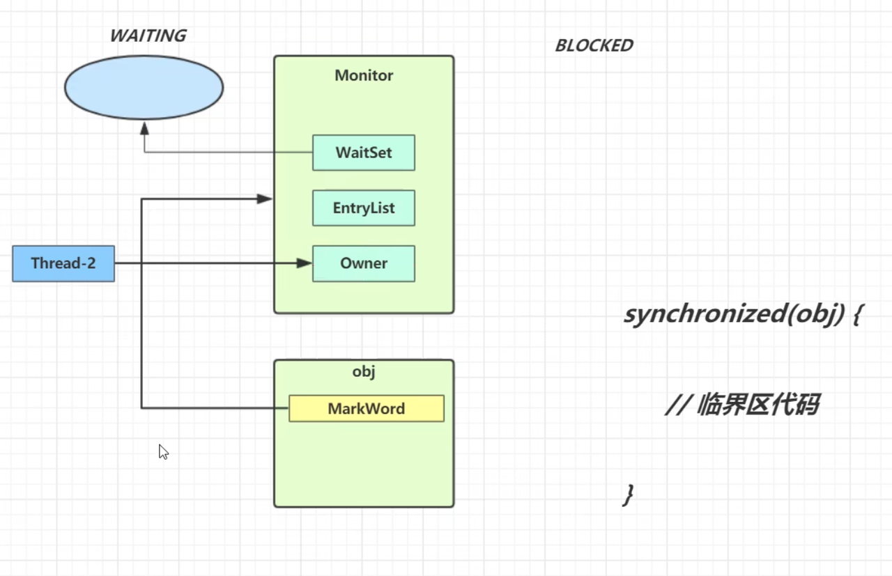

# Java 并发

##  JMM
定义了 Java 程序中多线程并发访问共享内存时的行为规范。

1. 主内存
主内存为 Java 中共享内存，所有线程均可访问（堆）。

2. 工作内存
工作内存（栈）是线程独立的内存区域，用于存储线程的局部变量和线程私有的对象。每个线程都有自己的工作内存，线程之间无法直接访问对方的工作内存。

3. 内存交互
Java 内存模型规定了一些规则和操作，用于线程间的通信和数据同步。这包括 `volatile` 变量的读写、`synchronized` 块的进入和退出、锁的获取和释放等。

4. 线程操作的可见性
指线程之间的可见性，即线程的一个操作对其他线程是可见的。使用 `volatile` 关键字或 `synchronized` 关键字来实现。

5. 原子性
操作不可被分割，对于复合操作（例如 `i++`），可以使用 `synchronized` 关键字或 `java.util.concurrent.atomic` 包中的原子类来保证原子性。

6. 有序性
多个操作之间存在先后关系，使用 `volatile` 关键字或 `synchronized` 关键字来进行指令的禁止重排，保证有序性。

##  创建线程的三种方法
1. 继承 `Thread` 类，重写 `run` 方法，调用 `start` 方法启动线程。
2. 实现 `Runnable` 接口，并传递给 `Thread` 类。
3. 使用 `FutureTask` 和 `Callable`。


##  线程的状态
1. **New**：线程被创建但尚未调用 `start` 方法。
2. **Runnable**：调用 `start` 方法，进入就绪状态。
3. **Running**：正在运行。
4. **Blocked**：阻塞态，等待临界资源。
5. **Wait**：等待其他线程唤醒（用 `notify()` 或者 `notifyAll()`）。
6. **Time_Waiting**：调用 `wait(timeout)` 或 `sleep()` 方法，等待一段时间后自动唤醒。
7. **Terminated**：终止状态。

##  Wait 方法
1. 当线程发现某些条件不满足时，会主动放弃锁，进入等待队列。此时的状态为 `waiting`。
2. 调用 `notify` 方法时，唤醒 `waitset` 中的一个线程。
3. 和 `sleep` 的区别：

   `wait` 是 `Object` 类的方法，而 `sleep` 是 `Thread` 类的方法。

    `sleep` 不需要 `synchronized`，不会放弃锁；而 `wait` 必须已经获取锁，即配合 `synchronized` 使用，并且会释放对象锁。

##  线程安全
线程安全指在多线程环境中，多个线程同时对共享资源进行读写操作时，有可能出现的错误包括：

1. 竞态条件：多个线程竞争对共享资源修改时，无法控制线程执行顺序。
2. 数据不一致：读写操作同时进行，有可能导致脏读。
3. 死锁：互斥，不可剥夺，请求保持，循环等待。
4. 资源竞争：导致性能下降，线程饥饿。

##  synchronized
功能：能够保证在同一时间内，只有一个线程执行某个方法或方法块。同时保证线程的变化可见（同 `volatile`）。

基本用法：
   1. 对多个线程使用的方法上加锁：等价于在对象实例上加锁 (`synchronized (this)`)，多个线程调用该实例 `synchronized` 修饰的方法时，需要获得锁才能执行。

```java
public class SynchronizedTest {
    public synchronized void method1() {
        System.out.println("Method 1 start");
        try {
            System.out.println("Method 1 execute");
            Thread.sleep(3000);
        } catch (InterruptedException e) {
            e.printStackTrace();
        }
        System.out.println("Method 1 end");
    }

    public synchronized void method2() {
        System.out.println("Method 2 start");
        try {
            System.out.println("Method 2 execute");
            Thread.sleep(1000);
        } catch (InterruptedException e) {
            e.printStackTrace();
        }
        System.out.println("Method 2 end");
    }

    public static void main(String[] args) {
        final SynchronizedTest test = new SynchronizedTest();

        new Thread(test::method1).start();
        new Thread(test::method2).start();
    }
}
    // method1 和 method2 顺序执行
    // 如果去掉 method2 的 synchronized 的关键字，则 method1 和 method2 交替执行
    // 如果在 main 中声明两个 SynchronizedTest 对象，分别调用其中的方法，交替执行    
```
2. 在静态方法或变量上加锁等价于对类加锁。
```java
    package Thread;
    public class SynchronizedTest {
    synchronized static void method1() {
        for (int i = 0; i < 100; i++) {
            System.out.println("method1 is running" + i);
        }
    }

    synchronized static void method2() {
        for (int i = 0; i < 100; i++) {
            System.out.println("method2 is running" + i);
        }
    }

    public static void main(String[] args) {
        Thread thread1 = new Thread(SynchronizedTest::method1);
        Thread thread2 = new Thread(SynchronizedTest::method2);
        thread1.start();
        thread2.start();
    }
}
// method1 和 method2 顺序执行
```
3.  对同步代码块上加锁等价于对象实例加锁。
```java
public class SynchronizedBlockExample {
    private int count = 0;
    private final Object lock = new Object();

    public void increment() {
        synchronized (lock) { // 同步代码块，使用 lock 对象作为锁
            count++;
            System.out.println("Count incremented: " + count);
        }
    }

    public static void main(String[] args) {
        SynchronizedBlockExample example = new SynchronizedBlockExample();

        Runnable runnable = () -> {
            for (int i = 0; i < 5; i++) {
                example.increment();
            }
        };

        Thread thread1 = new Thread(runnable);
        Thread thread2 = new Thread(runnable);

        thread1.start();
        thread2.start();
    }
}
// thread1 和 thread2 顺序执行
```

## `volatile` 关键字
volatile 实现了一种轻量级的同步机制，主要有两个作用：保证变量可见性，禁止指令重排。可见性指 volatile 关键字修饰的变量，修改后会立刻被其他线程看到。
```java
public class Singleton {
    private volatile static Singleton singleton;

    private Singleton() {}

    public static Singleton getSingleton() {
        if (singleton == null) { // 对象存在直接返回，加快执行速度
            synchronized (Singleton.class) {
                if (singleton == null) { // 此时如果其他线程已经完成了对象初始化，即刻返回
                    singleton = new Singleton();
                }
            }
        }
        return singleton;
    }
}

```


##  synchronized优化


###  锁的优化方法

在 JDK1.6 之前，synchronized 都是重量级锁，在加锁和释放过程中，操作系统会从用户态切换至核心态，系统开销很大。因此有以下四种优化方法：

#### 1 锁膨胀
锁升级是随着业务场景的要求提高，逐渐将锁升级：无锁，偏向锁，轻量级锁，重量级锁。

#### 2 锁消除
锁消除（Lock Elimination）是编译器在优化阶段进行的一项技术，用于消除程序中不必要的同步操作。它的目的是减少锁的使用，从而提高程序的性能。基于逃逸分析，判断变量是否会被其他线程访问，从而实现消除操作。

#### 3 锁粗化
将多个连续的加锁、解锁操作连接在一起，扩展成一个范围更大的锁，减少频繁的加锁解锁操作提高效率。

#### 4 自适应自旋锁
通过自身循环，尝试获取锁。避免了线程的挂起和恢复带来的开销。

###  重量级锁

涉及操作系统状态的转换，功能强但效率低下。

1. 每个对象都有 Mark word 字段，记录了 hashcode 等信息。线程执行对象的某个方法，并尝试进入 synchronized 代码块时，将对象的 mark word 字段更新为指向 monitor 对象（每个对象都和一个 monitor 对象关联）的地址，表示尝试获取哪个锁，monitor 对象由操作系统维护。当某线程获取锁后，其 monitor 对象会更改锁状态标记为“锁定”，并在 owner 中记录线程地址。若这个线程继续调用 wait() 方法后，锁状态改为“空闲”，将线程引用加入 waitset 中，当线程访问一个已经被锁定的 monitor 时，monitor 将线程引用加入 entryList 中。


2. 如果该对象锁已经关联了 monitor，则其他线程进入阻塞状态，和 entryList 关联。


3. 当锁被释放，则唤醒等待队列中的线程，等待队列中的线程通过竞争，获取资源。


###  轻量级锁

同一线程访问相同对象，对锁对象头的 mark word 字段进行 CAS 操作，尝试将 mark word 中字段指向当前线程，并对其重复加锁（锁重入），仍有优化空间。


1. 实现细节：当一个线程尝试进入一个同步块时，首先会检查对象头中 mark word 字段的锁标志。如果对象没有被锁定，线程会尝试使用 CAS（Compare and Swap）操作将锁标志设置为自己的线程 ID，这个过程是非常快速的，因此称之为轻量级锁。
2. 如果 CAS 操作成功，表示线程成功获取到了轻量级锁，锁标志置为 00，并且可以继续执行同步块。此时，其他线程仍然可以通过自旋（Spin）等待轻量级锁的释放而不进入阻塞状态。
3. 如果 CAS 操作失败（自旋超过时间限制），说明对象已经被其他线程获取到了轻量级锁，此时当前线程需要膨胀为重量级锁。膨胀过程会涉及到锁的释放、线程的阻塞等开销较大的操作。

###  偏向锁

如果一个锁仅由一个线程反复获取，为了让线程获取锁代价更低而引入偏向锁。在线程访问加锁对象时，会在对象头（mark word）记录本线程 ID，后续访问就不需要加锁解锁操作。

1. 线程获取对象资源时，会将其 mark word 字段前 25 位写成线程 ID，并将 biased_lock 字段写为 1。
2. 下一次线程尝试获取对象资源时，会检查上述字段，若和自己 ID 符合，则直接获得锁。
3. 当记录与当前线程 ID 不一致时，撤销偏向锁。

###  自旋

1. 使用自旋避免进入阻塞状态，从而减少上下文切换产生的系统开销。
2. 自适应——如果线程自旋成功了，则下次自旋的次数会增多，如果失败，下次自旋的次数会减少。

## 9. ReentrantLock 

### 对比 synchronized 有以下特点：

1. 可以中断——获取锁的过程中可以被中断，不需要一直等到获取锁之后才能进行其他逻辑处理。
2. 可以设置超时时间。
3. 可以设置为公平锁。
4. 支持多个条件变量（多个 waitset，不同的条件去不同的 waitset 队列等待）。

### 可重入锁

可重入指的是同一个线程可以在不释放的情况下，反复获取同一个锁，synchronized 也是可重入的，但是 synchronized 由 JVM 支持，对程序员是透明。而 ReentrantLock 依赖于 API，需要 lock 和 unlock 方法。

### 可打断
```java
ReentrantLock lock = new ReentrantLock();
lock.lock(); // 获取锁
try {
     lock.lockInterruptibly(); // 可以响应中断
    // 执行需要同步的代码块
}catch（InterruptedException e） {
// 响应中断,干别的事情去
}
finally {
    lock.unlock(); // 释放锁
}
```

1.   lock.lock(): 当一个线程调用lock.lock()方法尝试获取锁时，如果锁已经被其他线程持有，当前线程会进入阻塞状态，等待锁的释放。在这种情况下，如果当前线程被其他线程中断，它不会立即响应中断请求，而是继续等待锁的释放，直到成功获取锁或等待超时。
2. lock.lockInterruptibly(): 当一个线程调用lock.lockInterruptibly()方法尝试获取锁时，如果锁已经被其他线程持有，当前线程会进入阻塞状态，等待锁的释放。与lock.lock()不同的是，如果在等待锁的过程中，当前线程被其他线程中断，它会立即响应中断请求，抛出InterruptedException异常，以便线程可以在异常处理代码中处理中断情况。
3. synchronized不可被打断
4. 公平锁和不公平锁——当一个线程释放锁后，如果唤醒下一个线程的策略按照先来后到，则为公平。否则不公平。一般不使用公平锁。

 ### 乐观锁
乐观锁假设共享资源被多个线程访问时不会被修改，直接执行计算，仅在修改的时候通过CAS算法或版本号机制检查变量有没有被修改。如果有，则放弃本次计算结果，否则就完成修改。
1. 版本号机制：数据表中加入一个字段，表示该数据被修改的次数。通过检查预期版本和真实版本判断有没有其他线程对该线程进行更改。
2. CAS：CAS是一个原子操作，涉及三个操作数：内存地址 原始值 新值。当内存地址存放的值=原始值时，说明该值没有被修改，可以将新值写入，否则放弃修改。当多个线程试图同时修改操作数时，只有一个能获得锁，其他的自旋等待。

    CAS的缺陷：ABA问题：原始值被修改多次，但最终被修改成预期值，CAS无法判断出被修改了。解决思路：结合版本号机制。
 ### ThreadLocal
ThreadLocal保证了各个线程内部的局部变量互不干扰。典型的应用场景包括跨函数传递，线程隔离。ThreadLocalMap是一个Key为ThreadLocal对象的Map结构，每个线程都维护一个ThreadLocalMap。当线程对ThreadLocal变量进行修改时，实际上是在更新自己ThreadLocalMap中，ThreadLocal对应的value。下图中的Map就是ThreadLocalMap。


上图中的虚线表示弱引用，如果使用强引用，会导致ThreadLocal对象一直保持强引用状态，和线程生命周期绑定，无法销毁。但是使用弱引用的话，当ThreadLocal被置nnull，key在下次GC时就能回收。此时key=null，发生内存泄漏。及时调用ThreadLocal的remove方法，能够清除Key为null的数据。
##  线程池
### 池化思想
通过管理和重复使用的对象池来提高性能和资源利用率。需要时在池中获取，使用完毕后将对象返回池中，以供其他代码复用。

线程池能够提高线程利用率（重复利用线程），防止线程频繁的创建和销毁（即用即取，用完返回），便于统一管理线程对象，控制最大并发数（设置线程池大小）
###  线程池参数 
1. corePoolSize：核心线程数，一直在工作的线程数量
2. MaximumPoolSize ： 最大线程数（核心线程数 + 非核心线程数）非核心线程数在队列满时创建
3. KeepAliveTime： 空闲超过KeepAliveTime的非核心线程将被销毁
4. Unit 时间单位：
5. workQueue 工作队列： 基于数组（ArrayBlockingQueue，有界）、链表（LinkedBlockingQueue，有界；LinkedTransferQueue；有界；LinkedTransferQueue，无界）、优先级（PriorityBlockingQueue，有界）、时延（DelayQueue，有界）、同步（SynchronousQueue，无界）
6. rejectedExecutionHandler 拒绝策略。当线程队列已满且线程数量超过组大线程数时拒绝任务的提交。

    (1) AbortPolicy——抛出拒绝异常

    (2) DiscardPolicy——丢弃任务

    (3) DiscardOldestPolicy——丢弃最早的任务，把新任务入队

    (4) CallerRunsPolicy——让提交任务的线程执行任务
## AQS
AQS（AbstractQueuedSynchronizer）是一个可用于实现锁和同步机制的抽象类。维护了一个volatile变量state和一个双向队列（逻辑上的）。当线程尝试获取资源，即在尝试修改state（CAS操作）。如果state被成功修改则代表获取锁，失败则将本线程包装成Node对象，进入双向队列，等待锁资源。（其实就是实现了操作系统中的PV操作）独占锁将state设置为1或0，设置失败表示加锁失败。共享锁state进行自增（加锁）和自减（解锁）。
