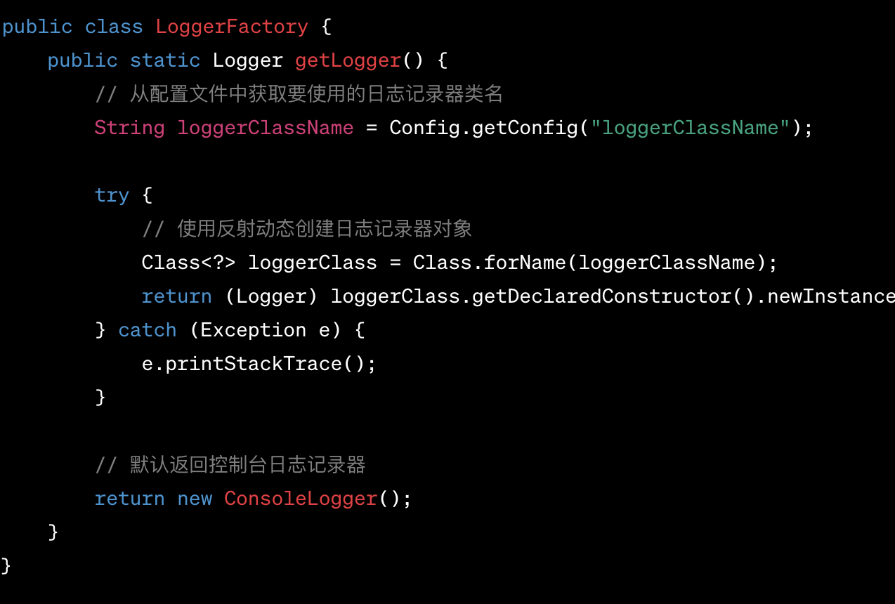
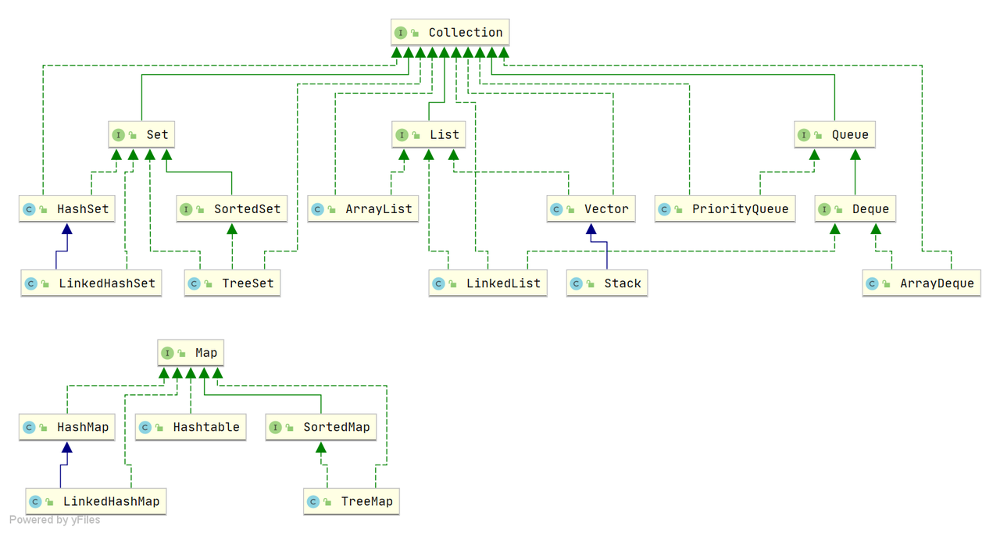

# Java基础

## Object.finalize()
对象在被回收之前自动调用。一般通过重写该方法进行资源的释放，如文件关闭，数据库连接断开。需要注意，不要主动调用 finalize 方法，有可能导致对象复活。

虚拟机中定义对象的状态：
- 可触及的（GC root 可达）
- 可复活的（可能在 finalize 方法中复活）
- 不可触及的（finalize 方法被调用，且没有复活）
## 三大特性：
- 封装
- 继承
- 多态
  
        向上转型。对于类Parent和Child，Child类继承Parent，此时可以用 Parent person = new Child()；声明对象，该对象实际指向一个Child类型的对象。但此时person调用Child中特有方法时，无法通过编译。
## 反射
 反射是在运行过程中动态操作类的信息，以及动态创建对象,调用方法。如下图，通过配置文件动态的创建不同的类对象。反射会对程序带来额外的计算开销。
 

获取Class对象的四种方法：
- 通过类获取 
- 通过全类名获取
- 通过对象获取
- 通过类路径获取

# Java集合

## ArrayList
有序，可重复，可存 null。在已知 idx 时，查询速度快。自动扩容至原长度 1.5 倍。
- 当 New 一个 ArrayList 时，ArrayList 的长度为 0。当第一次插入数据时，发生扩容，将容量扩充至 10。如果继续插入，扩容公式编程 `int newCapacity = oldCapacity + oldCapacity >> 1`，通过右移计算 `0.5 * size`，速度很快。

##  LinkedList
有序，可重复，可为 null。基于链表。不推荐使用，虽然链表的删除操作复杂度为 O(1)，但定位到删除位置仍需要复杂度 O(n)。

##  HashMap
非线程安全；key 可以为 null；负载因子 = 0.75，超过时容量至原长度 2 倍。底层结构为数组+链表。当链表长度超过 8 时且数组长度超过 64，将链表转换成红黑树；如果数组长度不超过 64，则对数组进行扩容。

##  LinkedHashMap
按照加入集合的顺序建立链表，可以顺序范围。

## TreeMap
基于红黑树和 Key 的自然顺序实现，增删查的时间复杂度均为 log(n)，常在 key 有序的情况下使用。其优势主要在于：范围查询，按续查询。

## HashSet
内部继承自 HashMap 实现，将元素值存放在 Key 上，因此元素无序，且不可重复。

## LinkedHashSet
继承自 LinkedHashMap，元素有序，不可重复。

