# Java内存分布
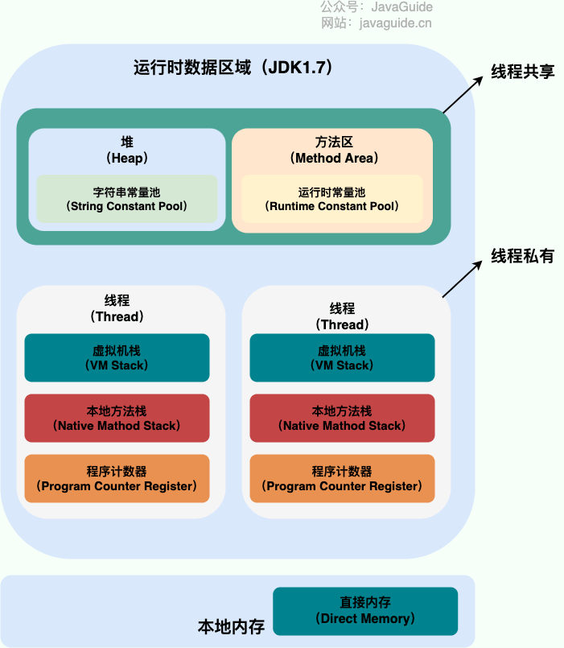
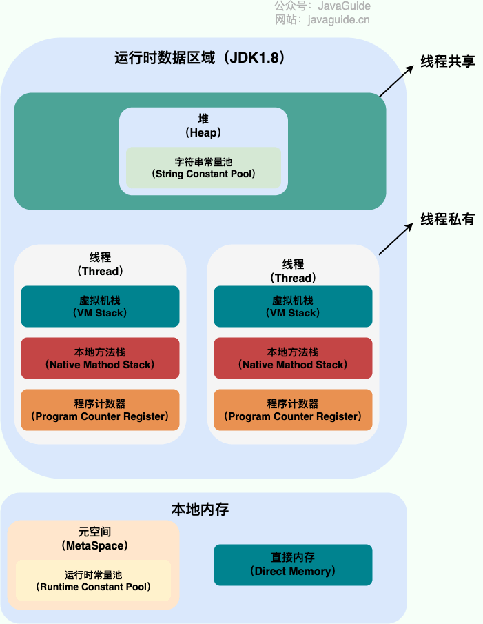

1. 1.8之后，元空间取代方法区，并从运行时数据区转移至本地内存中。
2. 方法区：或称永久代，记录了类信息、常量、静态变量、即时编译器优化后的代码等数据。
3. 堆：所有通过new的对象都存放在堆中。
4. 虚拟机栈：线程调用的方法存放在栈中。
   栈帧：栈中的单元，栈帧中包含局部变量表，操作数表，动态链接，方法返回地址。
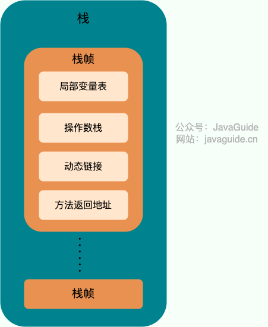
5. 本地方法栈：Native关键字修饰的方法（C，C++实现），运行时存放在本地方法栈中。
6. 程序计数器：指示下一条运行的指令。
7. 运行时常量池：存放类信息，包括字符串字面量、类和接口的全限定名、字段和方法的名称和描述符等。
8. 直接内存：通过直接使用操作系统本地内存（Native Memory）而不是通过Java虚拟机（JVM）管理的堆内存来分配和管理数据的一种技术。通常在大规模文件读写和大量数据处理场景下使用，将数据直接存放至内存中，避免文件从核心地址空间到和用户地址空间的复制。


# 对象的创建过程

遇到一条new指令后，虚拟机首先检查堆中是否存在该类对象。不存在则执行以下步骤：
1. 加载：JVM根据全限定名，将类字节码加载至JVM中。
2. 解析（链接）：验证字节码正误，将符号引用（方法的名称）转换为直接引用（方法的实际地址），再为类对象分配内存。分配内存有两种方式：指针碰撞和空闲列表。分配内存可能会涉及线程安全问题，使用CAS+失败重试和TLAB两种方法保证线程安全。
3. 初始化：JVM会执行类的静态初始化器（static块）和为静态变量赋零值。
4. 设置对象头：为对象设置信息，如对象所属类，对象哈希码，GC分代年龄等。存放在对象头中。
5. 执行init方法：执行构造函数，对象按照程序员的意愿进行初始化。

# 垃圾回收

原则：较多的回收新生代，较少的回收老年代，基本不动元空间（方法区、永久代）。在新生代满时触发YoungGC，老年代满时触发FullGC。

什么是垃圾？当一个对象没有任何引用时，成为垃圾。
1. 如何判断对象是不是垃圾？
   引用计数和可达性分析。引用计数法为每个对象维护一个整型的计数器属性，记录对象的引用数量；缺点是维护计数器属性，增加开销，同时无法解决循环引用问题，因此被JAVA放弃，python中仍使用，具体的回收方法是：
   除了引用计数（count）外，额外维护一个变量gc_ref，初始化为count-1（环中无外部变量引用的对象，gc_ref=0，被标记为"unreachable"）。
   从gc_ref!=0的对象开始再遍历一次，将与之相连的对象从unreachable链表中移除。
   最终还在unreachable中的即为垃圾。

   可达性分析以跟对象集合（GC Roots）为起点，搜寻目标对象是否可达。

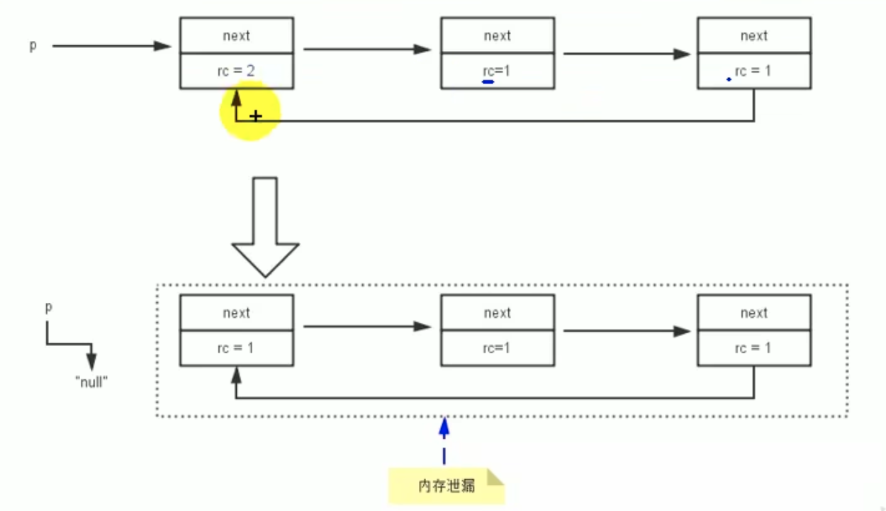
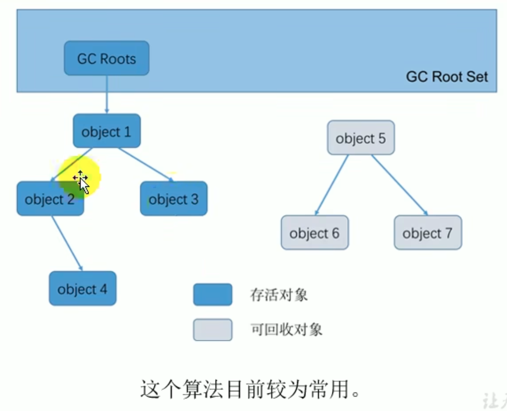


2. GC Roots
   GC roots包括：虚拟机栈和本地方法栈中的局部变量，方法区中的静态变量，字符串常量池中的对象，被synchronized持有的对象。总结：引用对象，指向堆内存中一个对象，但本身不存在于堆内存中，基本上就是root。

3. 垃圾回收算法
   1. 标记-清除算法：从GC Roots出发，在对象头中标记非垃圾对象。没有标记的对象则为垃圾对象。缺点：产生大量内存碎片。
   2. 复制算法：从GC Roots出发，找到的对象连续的复制到另一块内存区域中，并将现在的区域清空。缺点：内存要求高，移动过程中维护引用关系，开销较大。YongGC中的From区和To区。
   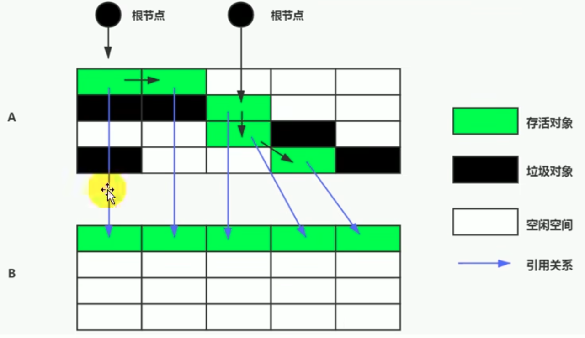

   3. 标记-整理（Mark-and-Compact）算法是根据老年代的特点（大对象直接进老年代）提出的一种标记算法，标记过程仍然与"标记-清除"算法一样，但后续步骤不是直接对可回收对象回收，而是让所有存活的对象向一端移动，然后直接清理掉端边界以外的内存。
   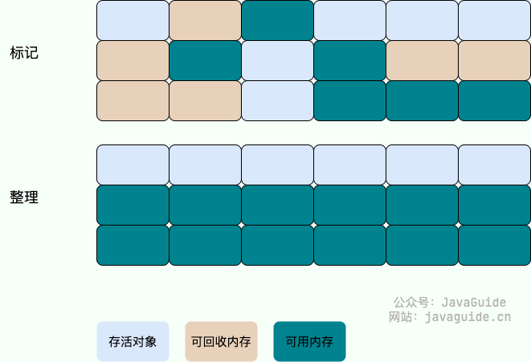   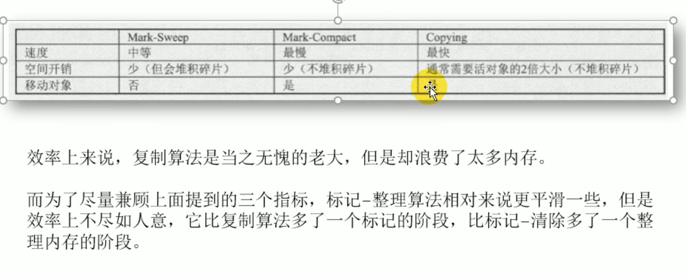


   4. 分代收集算法：对于不同的区域，使用不同的算法。在新生代中，每次回收大量对象，因此使用复制算法保证效率。老年代中，对象存活几率较高，同时对象占用较大，因此使用不产生碎片的标记整理算法。

# 对象引用

1. 强引用：不会回收强引用对象。 
   ```java
   Object obj = new Object(); // 这是一个强引用
   ```
2. 软引用：当资源不够时，回收软引用对象。—— 缓存
   ```java
   // 创建一个大对象并用软引用持有
   SoftReference<byte[]> softRef = new SoftReference<>(new byte[10 * 1024 * 1024]);
   ```
3. 弱引用：发现即回收——ThreadLocalMap中的key
   ```java
   WeakReference<String> weakRef = new WeakReference<>(new String("Hello, Weak Reference!"));
   ```
4. 虚引用：虚引用无法获取对象实例。虚引用必须和引用队列联合使用。当垃圾回收器准备回收对象时，会将虚引用加入与之关联的引用队列中。程序员可以通过检查引用队列，处理对象回收阶段的业务。例如为一个文件对象创建一个跟踪器，跟踪器虚引用实现。当引用队列中出现了跟踪器虚引用，说明文件对象即将被回收，此时可以进行删除临时文件，删除缓存等业务。
   ```java
   // 创建一个对象并用虚引用持有，并指定引用队列
   Object data = new Object();
   ReferenceQueue<Object> queue = new ReferenceQueue<>();
   PhantomReference<Object> phantomRef = new PhantomReference<>(data, queue);

   // 虚引用无法通过get()方法获取对象的实例
   System.out.println("Data from phantom reference: " + phantomRef.get());

   // 清除对象的强引用
   data = null;
   
   // 执行垃圾回收，观察虚引用是否被回收
   System.gc();

   // 虚引用被回收后，引用会被添加到引用队列中
   System.out.println("Data from phantom reference after GC: " + queue.poll());
   ```

# 垃圾回收器

1. Serial 回收器：单线程回收资源，新生代使用复制算法，老年代使用标记整理算法。在回收时必须暂停用户线程，在单核场景下使用。
2. ParNew收集器： Serial回收器的多线程回收版本（引入多个线程回收垃圾，减少暂停时间）。
3. Parallel Scavenge ：新生代使用复制算法，老年代使用标记整理算法，关注吞吐量（程序的执行时间/垃圾回收时间），能够自适应调整参数使吞吐量得到满足。
4. CMS收集器（jdk1.5之前使用）：使用标记清除算法进行回收老年代（新生代还是复制算法），真正实现了回收线程和用户线程的同时工作（横线下标为并发）。
   1. 初始标记：暂停其他线程，标记GC roots直接关联的对象，速度非常快；
   2. 并发标记：同时开启GC roots图遍历和用户线程，图遍历耗时较长，但可以和用户线程同步进行；并发标记会导致对象发生两种变化： 1. 不可达——>可达。 2. 可达——>不可达。
   3. 重新标记：将上一步中产生的不可达——>可达对象重新标记。如果没有重新标记阶段将这个对象标记为可达，那么在并发清除阶段被回收，这是严重的错误。
   4. 并发清除：清除垃圾的同时，启动用户线程（使用标记清除算法）。
   CMS的缺点是：
   使用标记清除算法，不可避免的导致内存碎片。
   多线程处理，对CPU资源比较敏感。
   CMS无法处理浮动垃圾（并发标记中新产生的垃圾，即 可达——>不可达 产生的新不可达对象）。
5. G1回收器（默认的回收器，大内存，多处理器的机器）
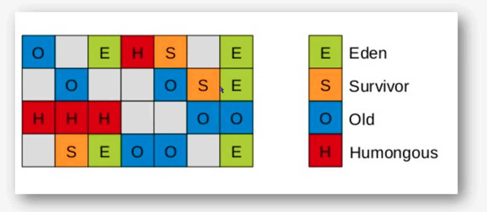
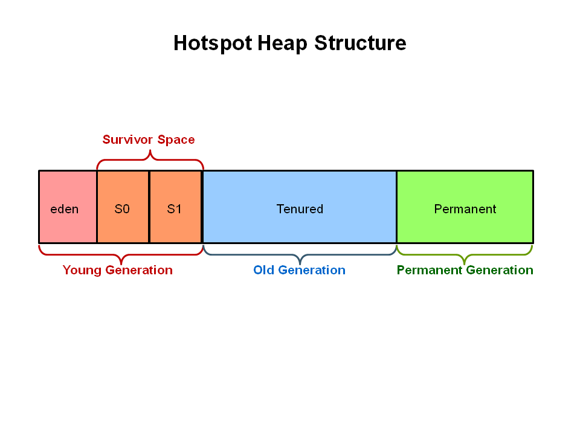
   1. 特点 ：与其他回收器将堆分为固定大小的连续区域不同，G1将堆分为多个不连续的区域（region）。区域之间通过复制算法，但整体上可以看作标记整理，避免内存碎片的产生。
   2. G1除了YoungGC（Eden区满触发），还有MixdCollection（当老年代占据45%Regin后，触发混合回收，对ESOH全部回收。）
   3. 可预测的停顿时间： G1回收器能够选取区域进行回收，控制回收范围。同时根据预估回收时间和回收空间大小，建立优先列表，回收价值最大的区域。
   4. 回收过程
      1. 初始标记：同CMS
      2. 并发标记：同CMS
      3. 最终标记：同CMS
      4. 筛选回收：根据优先列表，在预估时间内优先回收高优先级垃圾。
   G1垃圾回收器同样没有解决浮动垃圾的问题。


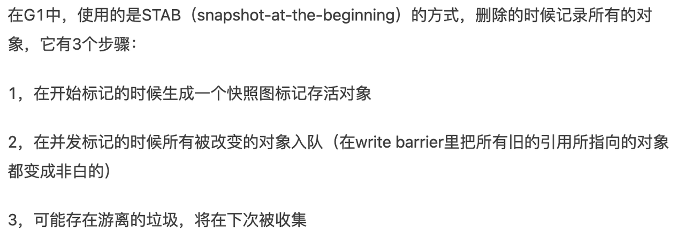


# 类的加载

1. 三个过程
   1. 加载：通过类的全限定名获取二进制字节流（.class 文件），并转化成方法区的数据结构，在内存中生成类Class对象，通过对象进行访问。
   2. 链接：
      1. 验证：确保字节流信息符合虚拟机要求。
      2. 准备：为变量分配内存，并设置为零值。
      3. 解析：符号引用转换成直接引用。（实际上JVM在类初始化过程中才会执行此步）。
   3. 初始化：执行类构造器方法<clinit>方法，该方法不需要定义，自动收集静态变量和静态代码块的代码实现的，编译器收集的顺序是由语句在源文件总出现的顺序决定的，静态语句块中只能访问到定义在静态语句块之前的变量，定义在其之后的变量，在前面的静态语句块中可以赋值，但是不能访问。

2. 类的加载
   1. 加载器
      使用不同类加载器的原因主要有：保护核心类库（只能用Bootstrap classloader加载），实现动态加载（通过自定义加载器，从不同数据源——网络，数据库等加载类），实现类隔离等（不同加载器加载的类不会互相干扰）。
      1. 引导类加载器（Bootstrap ClassLoader）：通过C/C++实现。Java核心类库（java、sun、javax开头的包），均使用引导器加载器加载。
      2. 扩展类加载器（Extension Class Loader）：派生于ClassLoader类，父类加载器为Bootstrap ClassLoader。
      3. 系统类加载器（System Class Loader）：派生于ClassLoader类，用户自定义类使用系统类加载器，父类加载器为Extension Class Loader。
      4. 自定义加载器：作用 隔离加载类——保证第三方插件不冲突；扩展加载源——如加载数据库中的class文件；防止源码泄漏——保护源码进行加密，解密用自定义类加载器实现。
      5. ClassLoader：除了引导类加载器，其他的类加载器都继承了ClassLoader，JVM规范中将这些类称为自定义加载器。
   2. 双亲委派机制
      Java对class文件是按需加载。如果一个类加载器收到类加载请求，会先让自己的父类加载器加载，如此反复，直到bootstrap classloader。如果父类可以完成类加载任务，则成功返回。如果失败，则子类进行加载。
      如果需要加载jar包中的类，会委派至bootstrap classloader进行加载。如果jar包中的类为第三方类，则会反向委派给系统类加载器，进行加载，称为反向委派。
      双亲委派机制能够：
      1. 避免类的重复加载，每个类只会被加载一次。
      2. 保护核心类库，防止恶意代码加载核心类库或系统类库，确保加载的类是经过验证的合法类，保证JVM的安全性。（沙箱安全机制）

# JVM调优的思路

1. 查看CPU占用：top命令 
2. 和Java内存指标 ：和 ps -ef ｜ grep java命令 