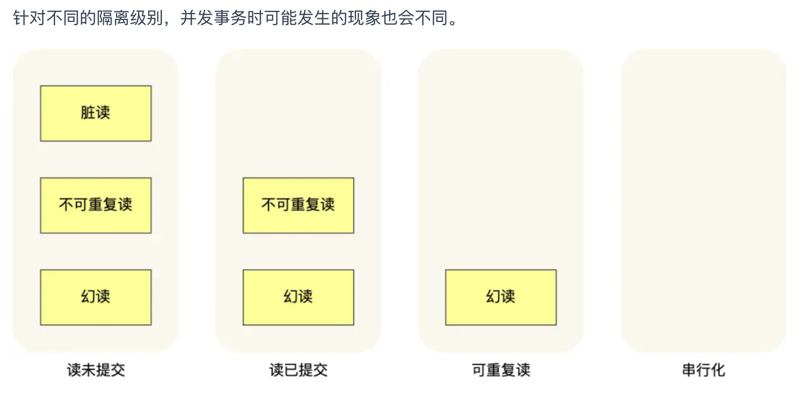

# MySQL

## B+树
1. mysql的数据存储在硬盘中，数据的读取通过磁盘I/O实现。因此读取非常耗时。使用二分查找的思想能够减少查询次数。但二分查找的前提是数据有序，满足这一条件并进行数据更新时开销极大。因此使用B+树。B+树本质上一个多叉平衡树，查询次数=树高度。能够减少查询次数，同时使用链表便于增删改的维护工作。相较B树，B+树将所有数据存放在叶子结点，减小了索引的内存开销从而建立更大的索引。B+树将数据存放在叶子结点，在增删数据时，不需要更改树的结构，开销更小。B+树使用链表将叶子结点串联，便于范围查询。

## 事务
1. 脏读：读到其他事务未提交的数据；事务A对数据修改但尚未提交，事务B读取到数据。如果事务A发生了回滚取消修改，事务B发生脏读。
2. 不可重复读：前后读取的数据不一致，事务A前后两次读取数据，发现数据不一致。
3. 幻读：前后读取的记录数量不一致，数据A前后两次范围查询，发现查询结果数量不一致。
4. 隔离：



## MVCC
1. innodb数据库中每行都有两个隐藏列，记录了最近修改本行数据的事务id号trx_id，以及一个指针，指向上版本记录。
2. Read view（快照），是MVCC的基础。通过快照，可以判断出当前事务和记录之间的版本关系（id在max_ids和min_trx_id之间的，均为存在但未提交的事务）。一个Read view的结构如下所示：


3. MVCC消除不可重复读：
   在开启一个事务时，创建一个read view。后续对数据的访问均基于此read view实现，数据的trx_id均小于当前read view的min_trx_id(通过日志查找)。
4. MVCC消除脏读：
   实际上消除脏读是通过事务的ACID实现的，在事务A提交之前，其修改对其他事务不可见。这里主要的意思是MVCC可以实现读提交隔离级别，即消除了脏读，但还有可能出现不可重复读——在事务每次读取数据时，都新建一个read view，这样就能够读取到其他事务在本事务完成之前的提交。

## 索引
1. 主键索引和二级索引
   Innodb存储数据库中每行信息，但是查找数据并不是从硬盘上读取一行数据，而是读取一页数据（16KB）。在硬盘上页和页通过指针相连组成双向链表，在逻辑上连续。页内的数据使用指针连接成单向链表，并对其数据分组，每组数据不多于8条。在分组和页之间都会统计主键最小值并记录，将遍历查询更改为二分查找，这就是主键索引。除了默认的主键索引，我们还可以使用其他列建立二级索引。二级索引的叶子节点中存放的是对应记录的主键值，二级索引查询出主键值后，回表查询主键索引，完成查询。因此推荐在使用MySQL时使用自增主键。
2. 并列索引：当表中存在多个独立的索引时，优化器会评估哪个条件的索引效率最高，它会选择最佳的索引去使用。
3. 索引失效
   1. 左模糊匹配和左右模糊匹配——因为索引建立的前提是可以比较索引列值的大小（或字符顺序），左模糊查询导致无法比较大小或顺序，因此索引失效。
   ```sql
   // 建立索引
   Create Index name_idx on table (name)
   // 左模糊查询索引失效
   Select age from tabel where name='%王'
   ```
   2. 对索引使用函数
   ```sql
   select name from t_user where length(name)=6 
   ```
   3. 对索引进行表达式计算
   ```sql
   select id from t_user where id + 1 = 10;
   ```
   4. 对索引隐式类型转换
      首先要知道，MYSQL在处理字符和数字的运算时，会自动将字符转换成数字。假如id在表中定义为INT型，下面的代码会将"1"自动转换成INT，虽然不会报错，但是索引会失效。
   ```sql
   select id from t_user where id = '1';
   ```
   5. 联合索引中存在非最左匹配
      创建联合索引（A，B，C）,下面的代码都可以通过索引查找
   ```sql
   select A, B, C from my_table where A=1 and B=2 and C=3
   select A, B from my_table where A=1 and B=2
   select A from my_table where A=1
   ```
      但如果查找中没有A字段，就会发生索引失效
   ```sql
   select B, C from my_table where B=2 and C=3
   select A,C from my_table where A=1 and C=2
   select B from my_table where B=1
   ```
   6. 在Where中使用OR，但是其中一个字段没有建立索引

## 锁
1. 按锁级别分类
   1. 共享锁（Share lock）——读锁，事务A对数据对象加上S锁，则只能读不能写，其他事务也可以加S锁，但不能加其他锁。
   2. 独占锁（exclusive lock）——写锁，如果事务A对数据对象加上X锁，事务A可读可写，其他事务不能加任何锁。
   3. 意向锁—— 在对行中数据加锁（S或者X）时，会为当前表加意向锁。在尝试获取表级锁时，事务会先尝试获取意向锁。意向共享锁和意向独占锁通常都是表级锁，不会和行级锁发生冲突，意向锁之间也不会冲突，只会和共享表锁和独占表锁发生冲突。因为没有意向锁的话，加表锁时需要遍历表的每一行，判断是否有行锁。如果有了意向锁，就可以快速判断表中是否有行被加锁。
2. 按锁粒度分类
   1. 全局锁——整个数据库仅能read操作，用于数据库备份阶段
   2. 表锁——对一张表加锁，使某个线程独占该表的读或者写权限
   3. 行级锁——对行内某些数据添加锁。在加行锁之前会添加意向锁
3. 其他锁
   1. AUTO-INC锁，表锁，在主键自增场景下使用。当插入新数据时，对主键字段加AUTO-INC锁，主键字段完成自增赋值后立刻释放，是一个轻量级锁。
   2. Record Lock，行锁，锁住行数据，分为读锁（S锁）或写锁（X锁）两种。
   3. Gap Lock，行锁，锁住一个区间，在区间内其他事务无法插入新的数据，解决幻读。
   4. Next-key Lock  = Record Lock + Gap Lock。锁住一个区间，其他事务不能访问区间内的数据，也不能插入。 