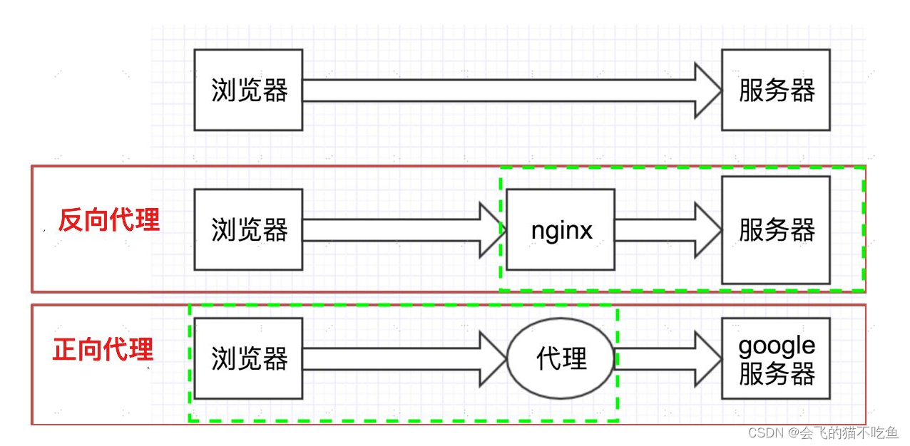
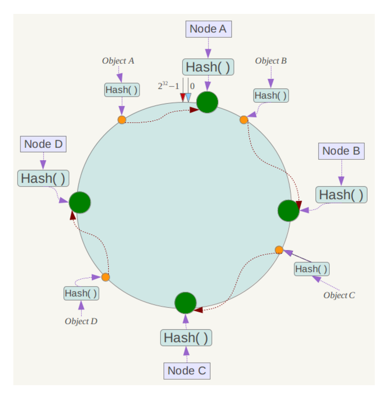

# Nginx

## Nginx的作用

### 反向代理
反向代理服务于服务器，对于客户端是透明的。当我们访问某个站点时，反向代理机制能够对访问请求进行管理，分发给相应的服务器。

### 负载均衡
如果访问请求量过大，有可能会导致服务器瘫痪。负载均衡的功能就是将服务请求合理的发送给服务器，防止服务器并发访问次数过多。

负载均衡算法有两类：

#### 静态算法
1. 轮询（加权轮询）：依次将请求分给不同的后端服务器。
2. 随机（加权随机）：将请求随机发送。
3. IP地址哈希：根据IP地址（也可以根据别的，比如header等）将其请求分发给固定的服务器，有利于会话保持。

#### 动态算法
1. 最少连接：分给当前连接数最少的服务器。
2. 最少时间：根据相应时间分发给相应最迅速的服务器。

#### 哈希一致性
在IP地址哈希算法中，哈希函数的计算过程为 IP%服务器个数。可以想到，当服务器个数发生变化时，原来的IP请求就无法映射到固定的服务器上了。哈希一致性算法为了解决这个问题，对服务器个数取mod的运算改成了对2^32取余。

具体来说：哈希一致性算法建立了一个地址环（共2^32个点），根据服务器和请求的IP地址，分别映射在环上。为每个请求选择在环上最近的服务器转发。

需要注意的是，当服务器节点分布不均匀时，会导致大量请求发送至某个服务器而其他服务器空闲的问题。解决这一现象的方法是使用分布均匀的虚拟节点，每个真实节点负责处理数量相同的虚拟节点上的请求。

### 动静分离
为了加快网站解析速度，可以把动态页面和静态页面由不同服务器解析。使用nginx控制。 