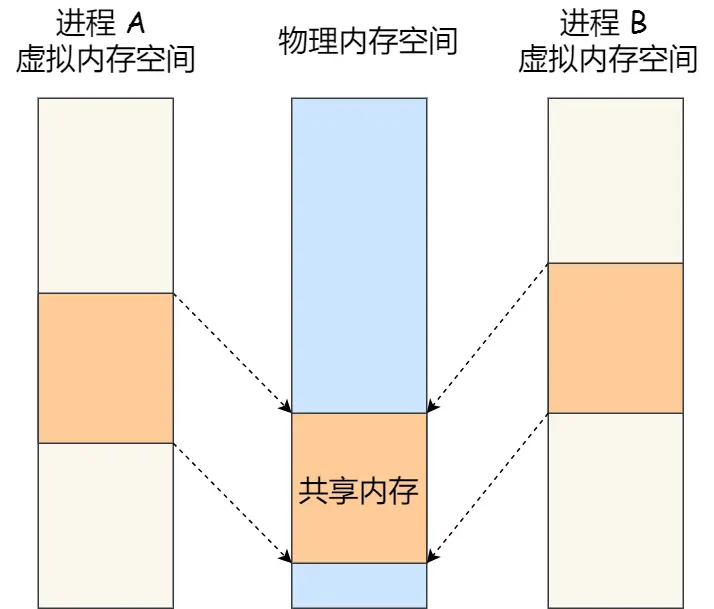

# 操作系统

## 进程调度算法
1. 先来先服务，非抢占，按顺序运行程序直至进程执行完毕。
2. 最短作业优先，优先运行较短耗时的进程。不利于长作业。
3. 高响应比优先，同时考虑等待时间和要求服务时间。

4. 时间片轮转调度算法，每个进程被分配一个时间片（Quantum），即允许该进程在该时间段中运行。
5. 最高优先级调度算法。静态优先级：进程创建时就确定。动态优先级：是随着时间的推移增加等待进程的优先级。
6. 多级反馈队列调度算法

## 进程间通信
1. 管道——单向通信，分为匿名管道和命名管道。其中匿名管道用于父进程和子进程，命名管道可以用于无关的两个进程。
2. 消息队列。消息队列是一种存放在内核中的消息链表，通信双方将信息存放在消息队列中，或从中取出发送给自己的消息。消息队列的缺点是消息大小受到限制，不适合较大信息的传输，同时有可能发生用户态到核心态的切换。
3. 共享内存。共享内存的机制，就是拿出一块虚拟地址空间来，映射到相同的物理内存中。这样这个进程写入的东西，另外一个进程马上就能看到了，都不需要拷贝来拷贝去，传来传去，大大提高了进程间通信的速度。

4. 信号量。使用共享内存时，有可能会发生数据的覆盖和修改。因此使用信号量来控制进程对内存的更改。信号量可以看作是可用资源的计数器，可以通过两个基本操作来修改其值：P（-1）V（+1）。
5. 套接字。IP地址：端口号，实现跨网络与不同主机上的进程之间通信。

## 锁
1. 互斥锁：锁是独占的，当线程A获取锁后，线程B申请锁失败会进入阻塞状态，直至A将锁释放。线程B的状态发生变化，发生了上下文切换。系统开销较大
2. 自旋锁：B线程获取锁失败时，不进行上下文切换，而是忙等待，避免状态变化带来的系统开销。
3. 读写锁。当写锁空闲时，线程能够并发地持有读锁。但是，一旦「写锁」被线程持有后，读线程的获取读锁的操作会被阻塞，而且其他写线程的获取写锁的操作也会被阻塞。
4. 乐观锁和悲观锁。上面几种锁均属于悲观锁，即认为多个线程访问资源时一定会发生冲突，因此避免其他线程的访问。而乐观锁则认为，即使多个线程同时访问资源，也不一定会发生冲突，因此乐观锁允许线程修改资源，再验证该过程中有没有发生冲突。如果发生冲突则放弃本次操作。

## 多路复用
多路复用是指使用一个进程处理多个IO请求的技术。详细信息可参考：https://zhuanlan.zhihu.com/p/367591714 