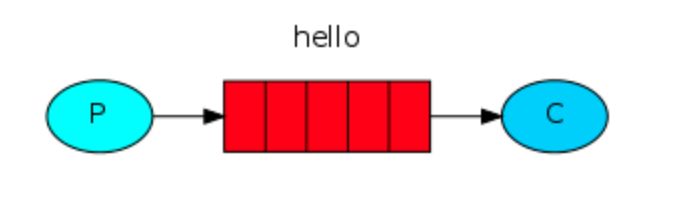
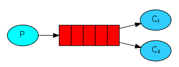
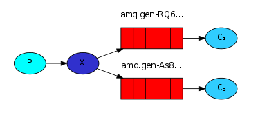
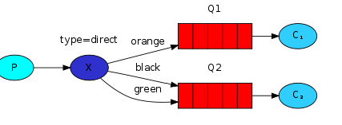
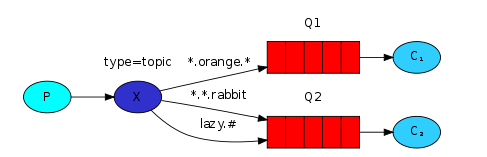
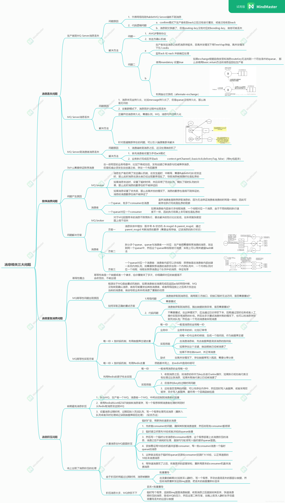

# RabbitMQ

## 为什么要用消息队列
1. 异步处理：将原有系统的串行逻辑通过消息分发的方式改为并行。
2. 流量削峰：对于高并发场景，消息队列能够实现缓存请求，控制并发数量的功能。
3. 应用解耦：引入中间件消息队列，能够防止上下游业务的耦合，降低系统耦合性。

## 消息队列的缺点
1. 系统可用性降低。如果消息队列挂了，系统就会瘫痪。
2. 一致性问题：如何保证消息队列和数据库中数据的一致性是个问题。

## 组成部分
1. 生产者——产生消息发送给交换机。
2. 消费者——从消息队列中获得消息。
3. 交换机——消息分发中心，将消息发送至各个消息队列。
4. 队列——存放由交换机分发的消息。
5. 通道——连接生产者和RabbitMQ服务器的虚拟连接。

## 工作过程
消息生产者和消费者都需要创建和RabbitMQ服务器的连接和通道。交换机和队列进行绑定。生产者产生消息，发送给RabbitMQ服务器，服务器的交换机将信息路由至对应的队列中，消费者从队列中取出消息处理。

## 交换机类型
1. 默认 default —— 每个新建的队列都和默认交换机自动绑定，绑定路由键和队列名称相同。
2. 直连交换机 —— 每个队列都有绑定键（Binding Key），交换机将消息发送给特定的一个队列。
3. 扇形 fanout —— 扇形交换机将消息发送给所有绑定在自己身上的队列。
4. 主题 topic —— 直连交换机的模糊匹配版。
5. 头交换机 headers —— 根据消息中的Headers进行匹配，更为灵活的直连交换机。

## 队列模型
这几种方式其中简单队列和工作队列描述了队列到消费者的过程，其余几种还是交换机到队列到过程。

### 简单队列模式
消费者监听队列，发现消息后消息出队（隐患）。

### 工作队列模式
多个消费者监听队列，分为轮询分发（一人一个）和公平分发两种（哪个有空发哪个）。

### 发布订阅队列模式
将消息发送给所有订阅的消费者队列，使用fanout交换机实现。

### 路由队列模式
匹配队列信息才能收到消息，使用直连交换机。

### 主题队列模式
路由队列的模糊匹配版，使用topic交换机。

## RabbitMQ的集群
### 普通集群模式
RabbitMQ有多个实例，每个工作队列和其中一个实例的交换机绑定。实例之间会同步队列，交换机和绑定等元数据，并不会直接共享具体的消息。

普通集群允许队列和交换机分散在不同节点上，从而实现分区存储，每个节点只负责部分队列的信息处理，实现负载均衡。

### 镜像集群模式
镜像集群的实例之间共享全部信息，保证信息的高可用和信息冗余。

## 死信队列
一个专门存放无法被消费者处理消息的队列。如果没有设置该队列时，死信消息被直接丢弃。当消息被拒绝，消息消费失败，或者消息存活时间超过TTL，或者待进入的工作队列已满，消息成为死信消息。

## 可靠传输
### 事务
在发送消息前开启事务，如果发送失败则回滚事务，成功则提交事务，保存更改。

### confirm机制（自动或手动两种）
开启手动确认（ack后删除队列中信息，nack让消息重新入队）。

#### 生产者发送消息确认
每个消息都分配一个ID，当消息投递到对应的队列中，broker就会自动发送一个确认给生产者。

1. 普通confirm：串行确认，收到确认后继续。
2. 批量confirm：一次确认一批，收到确认后继续。
3. 异步confirm：允许在收到确认之前执行其他任务。

#### 消费者
1. 当启用消费者确认机制后，当消费者确认后，才能从消息队列中删除消息。
2. 消费拒绝——basic.reject / basic.nack，拒绝一条或批量拒绝多条数据。被拒绝的数据可以选择放回队列，或者丢弃。

### 防止重复发送
借助redis记录已发送数据日志，发现当前数据在Redis中已经保存，则取消发送，防止重复发送。

## 其他问题

## 参考资料
- https://blog.csdn.net/nemoyss/article/details/118684182 