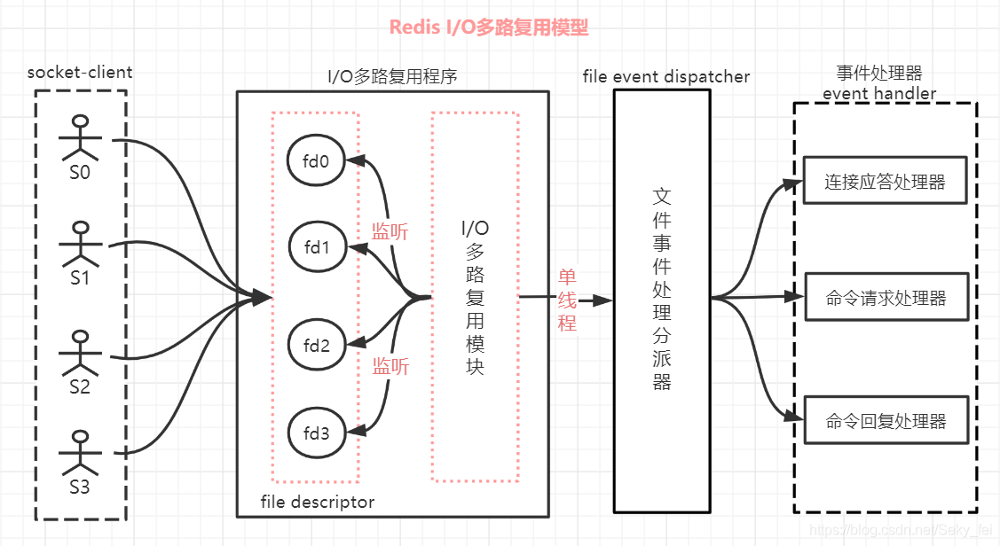
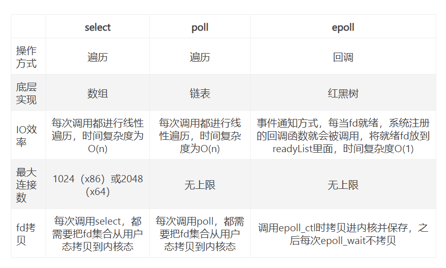
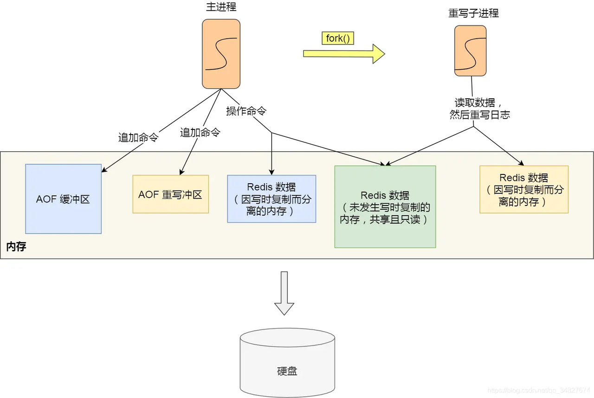
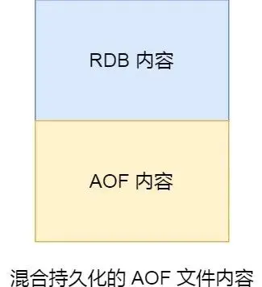
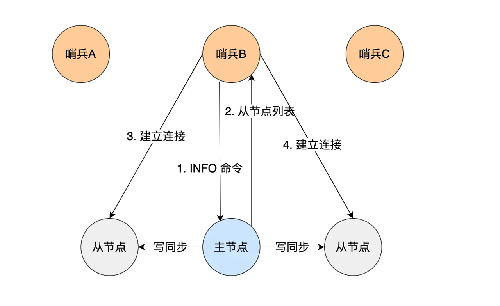
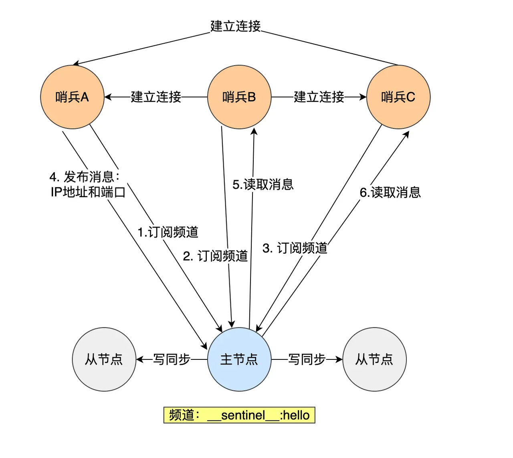
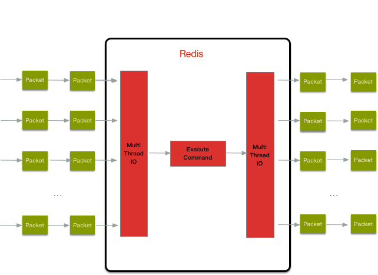

# Redis
Redis是一个基于内存的非关系型数据库，对文件的读写均在内存中完成，因此速度非常快。常用于缓存，消息队列，分布式锁等场景。
## 数据结构
 支持5种基本数据结构：字符串，哈希，列表，集合，有序集合。后续更新加入了BitMap，HyperLogLog，GEO，Stream。   

### 简单动态字符串SDS
在Redis中所有的字符串（Key，Value）均由SDS实现。SDS有三个属性int len， int alloc， char buf[]，分别记录了长度，总空间大小，和字符内容。
SDS和C中的字符串一样，结尾均有一个不计入总长度的空字符，只是为了能够适配C语言中的函数，不以此为结束标志，而是以len判断字符串边界。这使得SDS能够存储一切二进制数据。
在更改buf的内容时，Redis会判断新内容的长度如果超过了buf的最大长度，则会自动进行扩充，杜绝了缓冲区溢出。
扩充策略：空间预分配（字符串长度需要增加addlen时触发的扩容，将容量扩充为2 * （len+addlen)，但不超过1MB；超过1MB就扩充为newlen + 1MB）和 惰性空间释放（字符串缩短时，不立即减小char的大小，而是减小len。）
对编译过程进行优化，取消字节优化对齐，而按照实际占用的字节数对齐。


### linkedList 双向链表 
就是双向链表，pre和next指针占用8字节，是一个开销。同时链表导致内存碎片化也是一个问题。
### 压缩列表ziplist（redis 7 废弃，由listpack替代）
为了节约内存而设计的一种字节数组。数组中的每个元素紧紧相连以减少内存占用。然而每个元素都是不定长的，因此想要实现遍历，必须给每个元素添加一个字段previous_entry_length（默认1字节，最大可表示254字节的元素长度），表示上一个元素的长度。对于压缩列表某位置元素的插入和更新操作，涉及到其他元素，因此通常情况下时间复杂度为O（n）。

为什么要这样设计呢？

由于压缩列表中的数据以一种不规则的方式进行紧邻，无法通过后退指针来找到上一个元素，而通过保存上一个节点的长度，用当前的地址减去这个长度，就可以很容易的获取到了上一个节点的位置，通过一个一个节点向前回溯，来达到从表尾往表头遍历的操作


连锁更新：在压缩列表中，节点需要存放上一个节点的长度，当上一个节点A更新后长度大于254，下一个节点B的previous_entry_length字段进行扩容。扩容导致B的长度也大于254，因此C节点也要扩容，如此往复直至不扩容的节点。最坏情况时间复杂度为O（n* n）。

###  quicklist （ziplist的优化）
quicklist是ziplist和linkedlist的合体，将linkedList切分成段，段中使用ziplist存储，段和段之间用指针相连。


插入时首先定位插入节点位置，然后定位ziplist的插入位置。如果ziplist的大小在插入后不会超过限制，就直接插入。否则需要断开ziplist，分成两个新的节点，在其中的一个节点上插入。
注意如果头插或者尾插ziplist空间不足时，则创建新节点而不是分裂头节点或者尾节点。


### listpack
把ziplist的previous-entry_length改成了length，记录自己的长度

### 哈希表
Redis中的哈希表和Java的哈希表很类似，解决hash冲突的方法是链式哈希。
当hash表中的冲突过多（过长的链表导致查询开销增加），就会进行rehash，为哈希表扩容。如下图，ht为Redis的一个key，底层对应了两个哈希表。当哈希表1不够用时，就会将哈希表2的大小扩充为表1的两倍，并将其数据复制过来；然后清空表1。但是当表1的数据较大时，复制耗时较长有可能导致主线程阻塞。因此在世纪复制时，采用渐进式的rehash，在curd操作时会进行表1到表2的数据复制，该过程不是一次实现，分摊了一次性rehash的时间开销。
rehash在负载因子大于1的时候开始进行：
- 负载因子大于等于 1 ，并且 Redis 没有在执行 bgsave 命令或者 bgrewiteaof 命令，也就是没有执行 RDB 快照或没有进行 AOF 重写的时候，就会进行 rehash 操作。
- 当负载因子大于等于 5 时，此时说明哈希冲突非常严重了，不管有没有有在执行 RDB 快照或 AOF 重写，都会强制进行 rehash 操作。


### 跳表： 
跳表是一个带有层级关系的有序链表，每个层级可以包含多个节点，每个节点都通过指针串联。Redis在在zset中使用了跳表，能够支持O(logN)的查找操作。


查询过程：跳表会从最高层开始，逐一遍历每一层。如果当前节点的权重小于要查找的节点，则访问该层下一个节点。如果当前节点权重等于要查找节点但数据值（二进制）小于要查找节点，则访问该层下一个节点。当这两个条件均不满足，就用当前节点的下一层指针继续遍历。


跳表的相邻两层的节点数量最理想的比例是 2:1，查找复杂度可以降低到 O(logN)。但Redis并没有严格维持这个比例，节点创建时以25%的概率增加一次层数，可以重复增加。层数最大限制在64。如一个节点层数为三的概率为0.25 * 0.25。头节点层数=最大层数。
    
为什么redis实现zset时没有采用红黑树而是跳表？
- 跳表内存占用灵活。平衡树每个节点需要维护两个指针，而跳表平均需要 1/(1-p)个指针。redis默认p=0.25的情况下，平均每个节点只需要维护1.33个指针。
- 范围查找更加方便。b树的范围查找需要通过寻找最小值，再进行中序遍历得到，而跳表上十分容易实现范围查找。
- 跳表的实现难度较小。平衡树的节点插入删除逻辑较为复杂。

## Redis线程

1. Redis拥有多个线程，包括主线程，内存释放线程，关闭文件线程，AOF刷盘线程（Redis7新增了IO线程）。
2. 主线程的功能：接收请求，解析请求，读写数据，发送给客户端。这个过程由主线程这一个线程实现。
3. 内存释放线程：用来进行Redis内存释放，如unlike key ，flushdb async，flushall async等命令。这些方法独立于主线程，在不导致主线程卡顿的情况下完成内存释放，应该优先使用。

4. 为上面三个功能设计额外的线程，是因为这些任务非常耗时，放在主线程中会导致卡顿。客户端将这些任务放在任务队列中，后台线程从队列中取出任务执行。三个任务都有各自的任务队列。


5. IO线程（7.0新增）


## Redis 多路复用
保证Redis速度的一个条件就是redis的IO多路复用技术。IO多路复用有select，poll，epoll三种方式。Redis默认使用了epoll。

### select：
将fds文件描述符表示为bitmap（bitmap的每一位表示当前文件是否就绪），并将其从用户空间拷贝到核心空间，循环检查fds是否就绪。达到终止条件后（达到超时时间）将bitmap中对应位置的0置1。用户应用程序根据返回的bitmap进行处理。select函数执行时，用户进程会被阻塞。
缺点：1. bitmap大小存在上限（最多1024）。2. 需要循环查询fds是否就绪，效率低下。3. 复制bitmap性能开销较大
### poll:
对select进行了改进，使用了定义的pollfd数组代替bitmap，解决了1024的上限。
### Epoll
调用epoll_ctl方法，根据给定的fd文件描述符创建了epfd（类似select中的bitmap和poll中的pollfd）注意epfd没有被复制到内核态，而是在两个状态之间共享。epfd的底层实现是红黑树。
调用方法epoll_wait，将epfd中监听队列中的fd重排，将就绪的fd放在前面，并返回就绪fd的数量，实现了时间复杂度O(1). 解决了select的所有缺点。

```c
int epoll_create(int size);  // 返回一个epoll句柄。size为监听描述符的数量。但后续linux版本中size已经实际意义了

// epfd为epoll句柄，op为操作类型，fd为监听的描述符，event为响应事件（读，写等）
// 该方法为每个监听的描述符设置一个回调函数，并监听event。当fd上发生了event后，调用回调函数
// 将fd加入epoll实例的就绪队列中
int epoll_ctl(int epfd, int op, int fd, struct epoll_event event);
// 
// 被执行时，将就绪的描述符
int epoll_wait(int epfd, struct epoll_event  events, int maxevents, int timeout);
```

## Redis持久化
### AOF日志——每执行一次写操作命令，就将该命令以追加的方式写入到一个文件里
写操作记录了对数据库的更改，Redis重启时读取并执行该数据实现数据的恢复。
为什么先执行再写入？先执行命令（命令存入AOF缓冲区）再写入日志（从AOF缓冲区中写入文件），保证命令可执行避免额外的检查开销。写入日志的操作优先级低于执行写命令。
可能的风险：执行和写入是独立的两个过程，如果写入出错则数据丢失。写入日志的操作有可能阻塞其他命令。
#### 写回硬盘的策略：

#### AOF重写机制：当Redis写操作过多导致AOF文件很大时，触发AOF重写机制
1. 通过读取数据库中的所有Key Value对，生成相应的写入命令存入新建的AOF文件中，最终替换掉现在的AOF文件。
2. 重写AOF是通过后台子进程实现的，避免阻塞主进程。同时AOF重写开始后，Redis创建了一个AOF重写缓冲区，将重写过程发生的写命令存放到AOF重写缓冲区中。
3. 当重写完成后，将AOF重写缓冲区的数据追加至新的AOF文件中。

### RDB快照——在RDB文件中保存数据库数据信息
1. 全量数据通过save和bgsave命令保存在RDB文件，在redis启动时加载进内存中。
2. 快照通常设置一个间隔时间保存（save 60 100表示60s内，修改超过100次，进行一次保存）。因此如果服务器死机，损失会较大，但频繁保存快照开销又很大。
3. 使用bgsave命令，可以实现异步保存快照，Redis从主进程中fork一个子进程，父子进程共享内存。当数据未发生更改时，子进程保存快照，读取的内存是当前使用的内存，实现了子进程保存和主进程执行的并行。当数据A发生改变，会将物理内存复制一份得到A'，主线程对A'进行修改，bgsave子线程继续将原数据A写入。
### 混合使用 AOF 日志和内存快照
在AOF重写日志时，fork出的子线程将内存数据写入RDB的方式AOF文件，然后主线程的更改操作写入AOF文件，这样就能减少持久化过程中写数据的丢失


## Redis 过期删除
redis的key可以设置过期时间，实现过期删除功能。当我们对一个Key设置了过期时间，Redis会把Key带上过期时间（注意这个时间是一个时刻）存在过期字典中，字典的Key是指针指向对象，而Value是long整型，为过期时间。当查询一个值时，Redis会首先在过期字典中查询，如果存在着判断过期时间是否小于当前时间。
- 定时删除：在创建Key的过期时间时，会设置一个定时时间。当时间到达时自动删除Key。能够及时释放内存，但造成系统开销。
- 惰性删除：不主动删除，而是在访问时判断是否需要删除。
- 定期删除：每隔一段时间随机检查一些Key是否需要删除。

Redis默认删除规则是<b>定期删除+惰性删除</b>

## 内存淘汰
- 当Redis运行内存不足时，会触发内存淘汰删除符合条件的Key
- noeviction：当内存满时，写操作会触发OOM。
- volatile-random：随机淘汰设置了过期时间的Key
- volatile-ttl： 淘汰最早过期的Key
- volatile-lru：淘汰最久未使用的设置了过期时间的Key
- volatile-lfu：淘汰最最少使用的设置了过期时间的Key
- volatile-lru：淘汰最久未使用的设置了过期时间的Key
- allkeys-random：随机枪毙任意Key
- allkeys-lru： 淘汰最久未使用
- allkeys-lfu： 淘汰最少使用
- 注意allkey前缀在所有key中选择，而volatile在设置了过期时间的Key中选择。
## 主从复制
防止服务器死机导致所有数据丢失，Redis使用主从复制进行备份。
从服务器同步主服务器的写操作实现数据备份。使用命令实现主从服务器的设置。
```java
# 在服务器B上执行命令，B为A的从服务器
replicaof <服务器 A 的 IP 地址> <服务器 A 的 Redis 端口号>
```
执行命令时，从服务器B经历了三个阶段


1. 建立连接，协商同步（全量复制，类似混合持久化）从服务器发送链接建立请求，主服务器响应请求，并传输主服务器的标识符runID和复制进度offset=-1。接着主服务器执行bgsave命令，生成RDB文件传送给从服务器，并将生成文件过程中的写命令存入缓冲区。等从服务器载入RDB完成后，再将缓冲区的命令发过去。

2. 主服务器同步数据给从服务器
当第一次同步完成后，主从服务器之间保持一个长连接，实时的传送写命令。同时，从服务器也可以有自己的从服务器进行相同的操作。

3. 主服务器发送新的写命令
如果负责传输写命令的长连接意外中断，Redis执行增量复制。从服务器重新请求连接，此时的offset = slave_repl_offset。收到信息的主服务器，将从中断开始的地方发送写命令。
具体实现是：主服务器会维护一个环形缓冲区repl_backlog_buffer并将最近的写命令写入其中；一个偏移量master_repl_offset记录写的位置。从服务器根据自己收到的写命令，维护自己的偏移量slave_repl_offset。主服务器通过slave_repl_offset和master_repl_offset判断重发策略：如果命令还在缓冲区中，则写入发送缓存（建立连接时等待从服务器载入RDB文件的那个缓存），否则进行全量复制（如第一次建立同步）。

## 哨兵机制
  主服务器负责接收客户端的各种命令，如果主服务器崩溃，会导致大量数据丢失。因此需要哨兵机制检测主服务器的活动。当主服务挂掉，哨兵会在从服务器中选一个当作新的主服务器。
  哨兵的三个功能
1. 监视：哨兵每秒都会向所有服务器发送ping命令，如果在规定时间内收不到某个节点的响应，则判断该节点主观下线。防止一个哨兵节点做出误判（网络拥塞导致信号传递丢失等情况），通常使用三个以上的哨兵（集群）。当N/2 + 1个（可变参数）哨兵都判定一个节点主观下线时，则可以认为该节点客观下线。

2. 主从复制：当主服务器死机时，哨兵会在从服务器中选择一个充当主服务器。主要涉及两个过程：选择领头哨兵和选择主服务器。每当一个哨兵发现主服务下线后，都会通知其他节点，并要求其他服务器选择自己作为领头哨兵，如果N/2 + 1个哨兵都同意，则该哨兵当选领头哨兵。由领头哨兵负责在从服务器中选择新的主服务器，将已经下线的主服务设置成从服务器。主服务器的选择标准是：选择一个在线的服务器，并且该服务器和原来的主服务器，断联时间不超过down-after-millisecond且断联次数不超过10次。经过筛选后，领头哨兵还要对服务器进行打分，会给优先级高（人工设定）的服务器打高分；会给和原主库同步率最高的从库打高分。经过筛选和打分两步，最终选择新主库，完成主从复制。

3. 通知：通过 Redis 的发布者/订阅者机制，通知其他从服务器主服务器已经更换。

## 哨兵集群
1. 哨兵集群初始化时，只需要设置主节点信息（IP、端口号）。哨兵将自己的IP地址和端口号发送到主服务器的__sentinel__:hello频道上，B、C订阅了该频道，就能通过该频道直接获取A的IP地址和端口号，然后B、C可以和哨兵建立网络连接。哨兵通过向主服务器发送INFO命令，获取从服务的信息。



## 缓存雪崩
当Redis中的数据过期时，业务会访问数据库获取数据并更新至Redis中。当大量数据同时过期，用户请求直接访问数据库，导致数据库压力增大，有可能导致系统崩溃.

解决雪崩的策略:
- 事前策略：
    1. 构建多级缓存：nginx缓存 + redis缓存 +其他缓存（ehcache等）
    2. 均匀设置过期时间，防止数据同时失效。对数据库的访问加互斥锁，防止数据库压力过大。
    3. 不设置过期时间，当缓存满时会触发内存淘汰；此时有两种解决办法：需要后台线程频繁的检测缓存是否有效，如果失效则立刻更新。或者由业务线程判断，当业务线程获取数据时发现该数据已被淘汰，则会通过消息队列向服务器发送消息，请求更新缓存。
- 事中策略：发现雪崩开始后，启动熔断+限流机制
- 事后应对：redis持久化，快速从磁盘上恢复数据
## 缓存击穿
  Redis中的某个数据已过期，但收到了对该数据的大量访问请求。大量访问请求转而查询数据库，导致数据库崩溃。
## 缓存穿透
  频繁查询在数据库和Redis中都不存在的记录，尽管不存在数据，但每次都需要到数据库中查询。大量访问场景下有可能导致数据库崩溃。
  应对策略： 布隆过滤器，将所有可能存在的数据hash到bitmap中，通过它快速判断一个元素是否存在。缓存空值，将不存在的数据短暂的加入缓存，值设置为null。
## 一致性
1. 双删：先删除Redis中的缓存，然后再删数据库。间隔一个时间段后再删Redis（防止数据库删除尚未成功，就重新加载了新的缓存）
2. 订阅MYSQL binlog日志，发现数据变化后删除Redis缓存。如果删除失败则将命令加入 消息队列，重复命令。
## 其他问题
- 脑裂怎么解决？
    1. min-slaves-to-write：与主节点通信的从节点数量必须大于等于该值主节点，否则主节点拒绝写入。
    2. min-slaves-max-lag：主节点与从节点通信的 ACK 消息延迟必须小于该值，否则主节点拒绝写入。
    在Redis中，两个条件必须同时满足，负责主节点无法写入。
    扩展：zookeeper防止脑裂的方式是——主节点必须将数据写入大多数从节点中，才算写入成功。
- 哈希槽
    1. redis集群中，数据分片没有使用一致性哈希，而是使用哈希槽实现。哈希槽大小为16384（2KB），所有数据key被映射到槽中，每个节点分管一部分槽，实现数据分片。
- 缓存一致
    
- 分布式锁
    - 初级版：setex加锁（原子性） + lua解锁（检查持有人，保证原子性）
      1. 使用SETEX命令，设置一个特殊的键值对（"lock"，"requestId"）作为锁，并指定过期时间。在写数据前先检查"lock"是否存在，如果存在，说明有锁，需要等待。requestId则指明了加锁人（也可以是线程id），可以防止解锁过程出现错误。
      2. 分布式锁续期：watchDog机制，加锁默认30s过期，每隔10s检查锁，如果锁仍然存在并且锁由当前线程创建，就续期30s，过程通过lua脚本实现保证原子性。（redission）
    - 高级版：在一个场景中，有多个互相独立的master，每个master都有多个slave。锁是加在master上的，如果这个master挂了，新选上来的master是没有锁的，造成了锁丢失。
    
        使用Redlock解决。主要思想就是节点在执行操作之前要确保能获取到半数以上节点的锁，并确保锁有效（检查过期时间）。
- IO多线程

    Redis6之后引入了IO多线程。对于单线程 Redis 来说，性能瓶颈主要在于网络的 IO 消耗。Redis 的多线程部分只是用来处理网络数据的读写和协议解析，执行命令仍然是单线程。之所以这么设计是不想因为多线程而变得复杂，需要去控制 key、lua、事务，LPUSH/LPOP 等等的并发问题。
    
