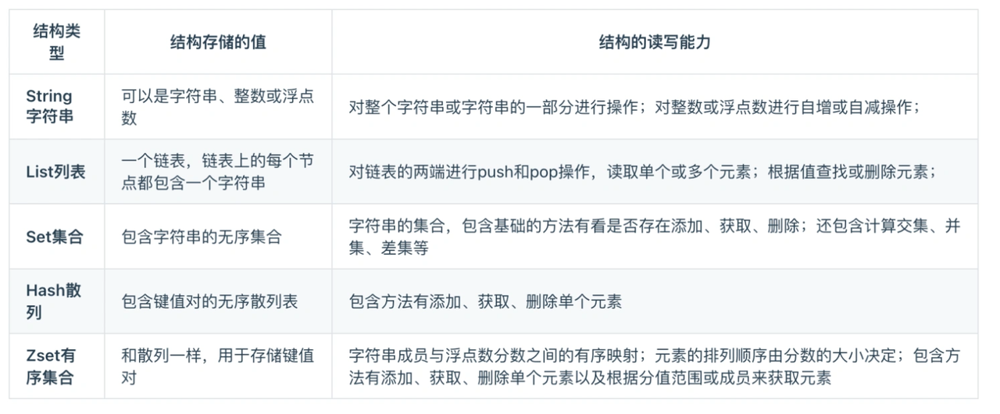
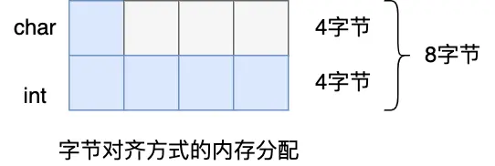
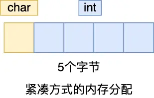
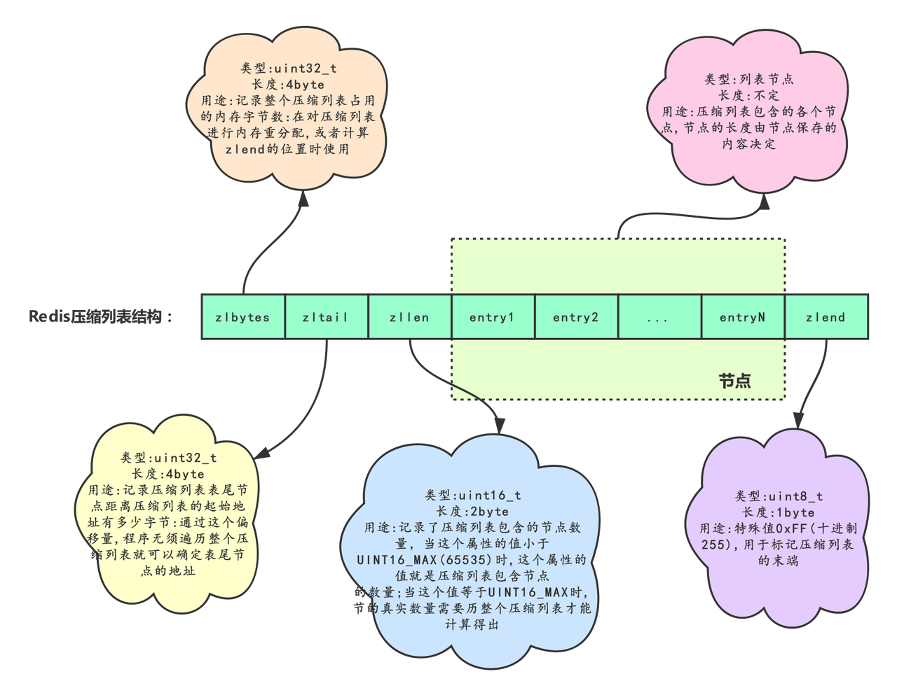
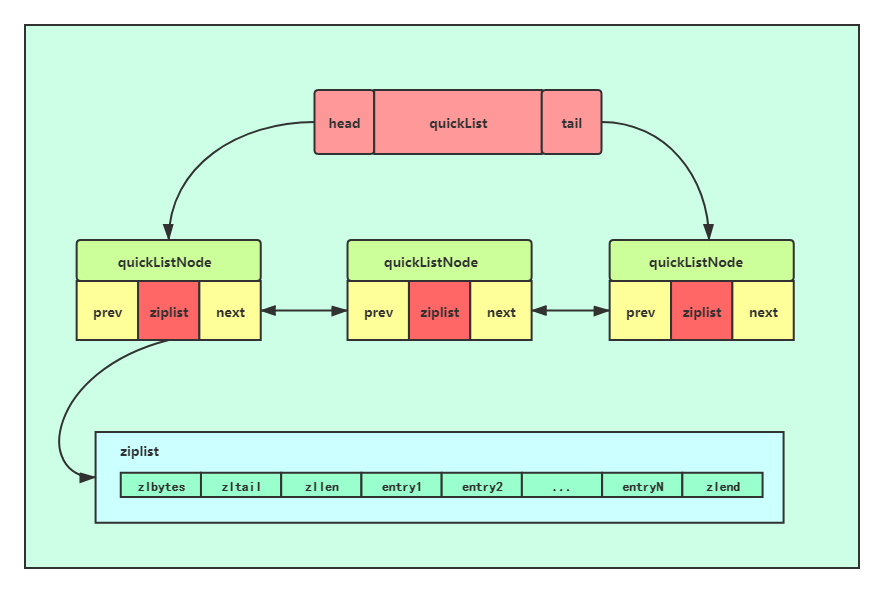
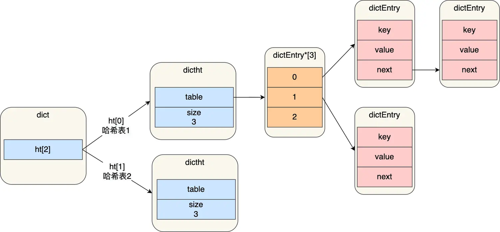
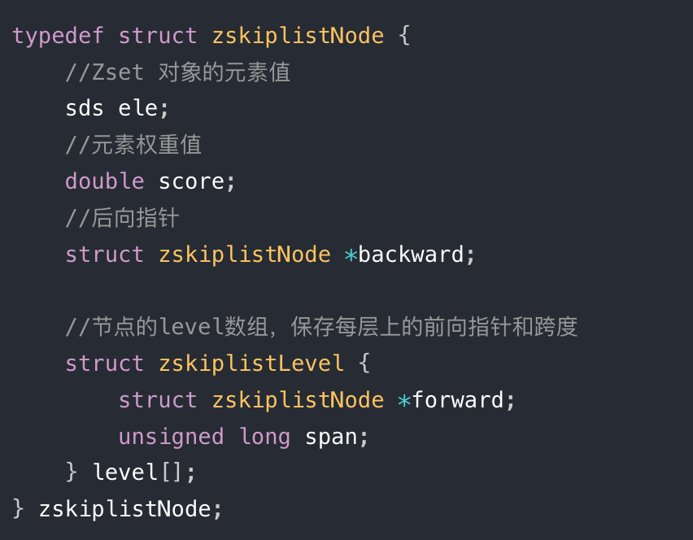
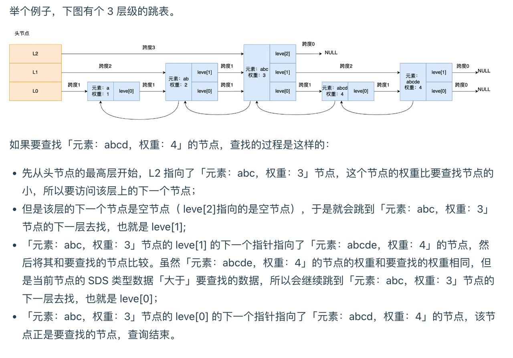
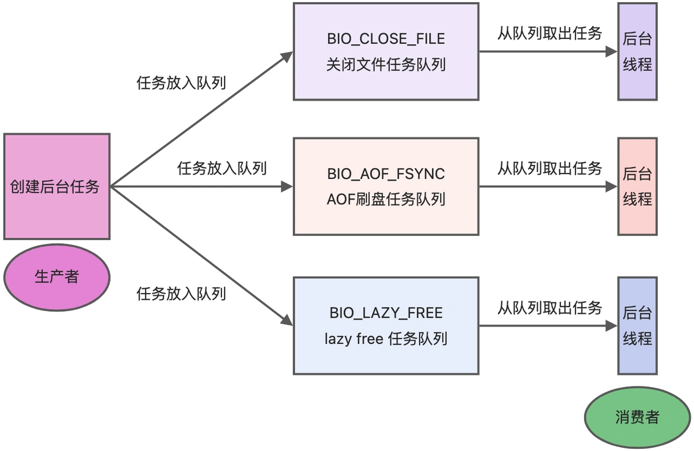
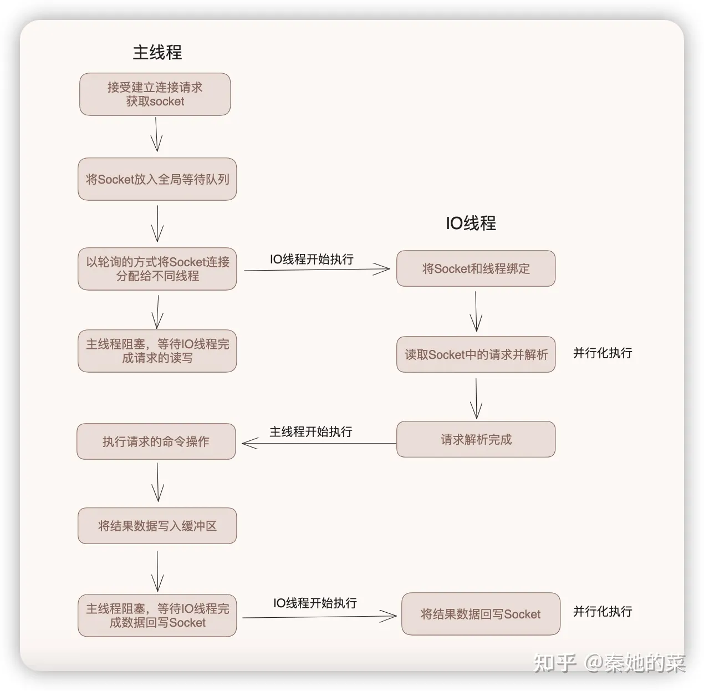

# Redis
Redis是一个基于内存的非关系型数据库，对文件的读写均在内存中完成，因此速度非常快。常用于缓存，消息队列，分布式锁等场景。
## 数据结构
 支持5种基本数据结构：字符串，哈希，列表，集合，有序集合。后续更新加入了BitMap，HyperLogLog，GEO，Stream。   

### 简单动态字符串SDS
在Redis中所有的字符串（Key，Value）均由SDS实现。SDS有三个属性int len， int alloc， char buf[]，分别记录了长度，总空间大小，和字符内容。
SDS和C中的字符串一样，结尾均有一个不计入总长度的空字符，只是为了能够适配C语言中的函数，不以此为结束标志，而是以len判断字符串边界。这使得SDS能够存储一切二进制数据。
在更改buf的内容时，Redis会判断新内容的长度如果超过了buf的最大长度，则会自动进行扩充，杜绝了缓冲区溢出。
扩充策略：空间预分配（字符串长度需要增加addlen时触发的扩容，将容量扩充为2 * （len+addlen)，但不超过1MB；超过1MB就扩充为newlen + 1MB）和 惰性空间释放（字符串缩短时，不立即减小char的大小，而是减小len。）
对编译过程进行优化，取消字节优化对齐，而按照实际占用的字节数对齐。

### linkedList 双向链表 
就是双向链表，pre和next指针占用8字节，是一个开销。同时链表导致内存碎片化也是一个问题。
### 压缩列表ziplist（redis 7 废弃，由listpack替代）
为了节约内存而设计的一种字节数组。数组中的每个元素紧紧相连以减少内存占用。然而每个元素都是不定长的，因此想要实现遍历，必须给每个元素添加一个字段previous_entry_length（默认1字节，最大可表示254字节的元素长度），表示上一个元素的长度。对于压缩列表某位置元素的插入和更新操作，涉及到其他元素，因此通常情况下时间复杂度为O（n）。

为什么要这样设计呢？

由于压缩列表中的数据以一种不规则的方式进行紧邻，无法通过后退指针来找到上一个元素，而通过保存上一个节点的长度，用当前的地址减去这个长度，就可以很容易的获取到了上一个节点的位置，通过一个一个节点向前回溯，来达到从表尾往表头遍历的操作

连锁更新：在压缩列表中，节点需要存放上一个节点的长度，当上一个节点A更新后长度大于254，下一个节点B的previous_entry_length字段进行扩容。扩容导致B的长度也大于254，因此C节点也要扩容，如此往复直至不扩容的节点。最坏情况时间复杂度为O（n* n）。

###  quicklist （ziplist的优化）
quicklist是ziplist和linkedlist的合体，将linkedList切分成段，段中使用ziplist存储，段和段之间用指针相连。

插入时首先定位插入节点位置，然后定位ziplist的插入位置。如果ziplist的大小在插入后不会超过限制，就直接插入。否则需要断开ziplist，分成两个新的节点，在其中的一个节点上插入。
注意如果头插或者尾插ziplist空间不足时，则创建新节点而不是分裂头节点或者尾节点。

### listpack
把ziplist的previous-entry_length改成了length，记录自己的长度

### 哈希表
Redis中的哈希表和Java的哈希表很类似，解决hash冲突的方法是链式哈希。
当hash表中的冲突过多（过长的链表导致查询开销增加），就会进行rehash，为哈希表扩容。如下图，ht为Redis的一个key，底层对应了两个哈希表。当哈希表1不够用时，就会将哈希表2的大小扩充为表1的两倍，并将其数据复制过来；然后清空表1。但是当表1的数据较大时，复制耗时较长有可能导致主线程阻塞。因此在世纪复制时，采用渐进式的rehash，在curd操作时会进行表1到表2的数据复制，该过程不是一次实现，分摊了一次性rehash的时间开销。
rehash在负载因子大于1的时候开始进行：
- 负载因子大于等于 1 ，并且 Redis 没有在执行 bgsave 命令或者 bgrewiteaof 命令，也就是没有执行 RDB 快照或没有进行 AOF 重写的时候，就会进行 rehash 操作。
- 当负载因子大于等于 5 时，此时说明哈希冲突非常严重了，不管有没有有在执行 RDB 快照或 AOF 重写，都会强制进行 rehash 操作。

### 跳表： 
跳表是一个带有层级关系的有序链表，每个层级可以包含多个节点，每个节点都通过指针串联。Redis在在zset中使用了跳表，能够支持O(logN)的查找操作。

查询过程：跳表会从最高层开始，逐一遍历每一层。如果当前节点的权重小于要查找的节点，则访问该层下一个节点。如果当前节点权重等于要查找节点但数据值（二进制）小于要查找节点，则访问该层下一个节点。当这两个条件均不满足，就用当前节点的下一层指针继续遍历。

跳表的相邻两层的节点数量最理想的比例是 2:1，查找复杂度可以降低到 O(logN)。但Redis并没有严格维持这个比例，节点创建时以25%的概率增加一次层数，可以重复增加。层数最大限制在64。如一个节点层数为三的概率为0.25 * 0.25。头节点层数=最大层数。
    
为什么redis实现zset时没有采用红黑树而是跳表？
- 跳表内存占用灵活。平衡树每个节点需要维护两个指针，而跳表平均需要 1/(1-p)个指针。redis默认p=0.25的情况下，平均每个节点只需要维护1.33个指针。
- 范围查找更加方便。b树的范围查找需要通过寻找最小值，再进行中序遍历得到，而跳表上十分容易实现范围查找。
- 跳表的实现难度较小。平衡树的节点插入删除逻辑较为复杂。

## Redis线程

1. Redis拥有多个线程，包括主线程，内存释放线程，关闭文件线程，AOF刷盘线程（Redis7新增了IO线程）。
2. 主线程的功能：接收请求，解析请求，读写数据，发送给客户端。这个过程由主线程这一个线程实现。
3. 内存释放线程：用来进行Redis内存释放，如unlike key ，flushdb async，flushall async等命令。这些方法独立于主线程，在不导致主线程卡顿的情况下完成内存释放，应该优先使用。

4. 为上面三个功能设计额外的线程，是因为这些任务非常耗时，放在主线程中会导致卡顿。客户端将这些任务放在任务队列中，后台线程从队列中取出任务执行。三个任务都有各自的任务队列。

5. IO线程（7.0新增）

