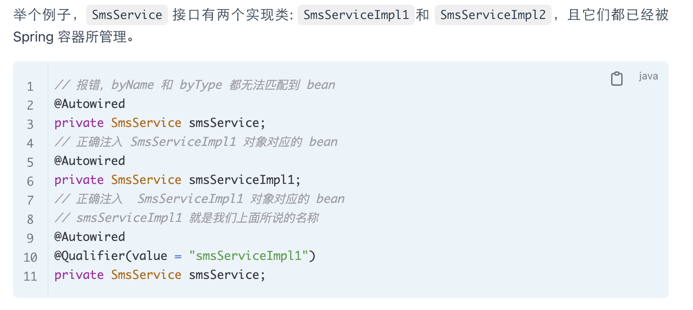
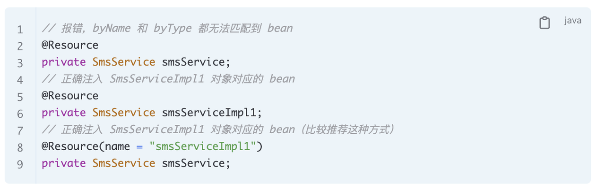
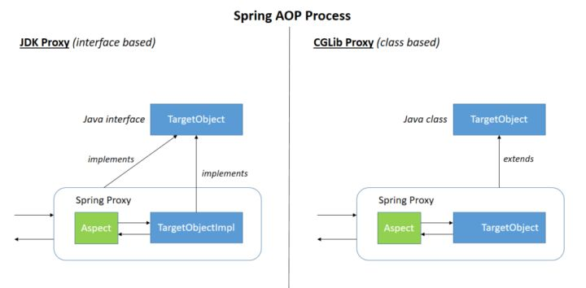
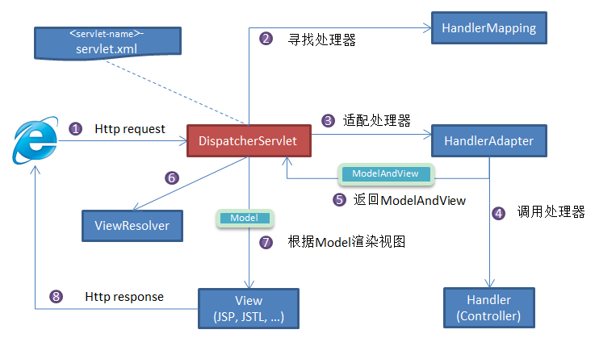
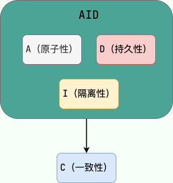
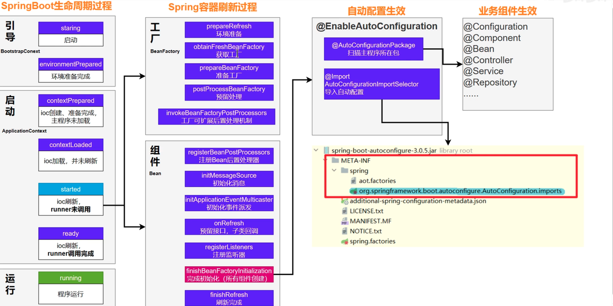

# Spring相关

## 1. 控制反转是一种设计思想
控制反转（Inversion of Control, IOC）是一种设计思想，主要思想是将在程序中手动创建对象的过程，交给框架处理。将对象之间的相互依赖关系交给 IoC 容器来管理，并由 IoC 容器完成对象的注入。简化应用的开发，把应用从复杂的依赖关系中解放出来。当我们需要创建一个对象的时候，只需要配置好配置文件/注解即可，完全不用考虑对象是如何被创建出来的。IoC 容器实际上就是个 Map（key，value）。

## 2. IOC容器中存放的内容包括
### 2.1. Bean定义
Bean定义是描述组件的元数据，它包含了组件的类型、依赖关系、初始化方法、销毁方法等信息。在应用程序启动时，IOC容器会根据配置或者自动扫描机制，将所有的Bean定义注册到IOC容器中。

### 2.2. Bean实例
当应用程序需要使用某个组件时，IOC容器会根据Bean定义创建相应的Bean实例，并负责管理这些实例的生命周期。实例化过程可能涉及到构造函数的调用、属性的赋值以及依赖的解析和注入等操作。

### 2.3. 依赖关系
IOC容器通过依赖注入（Dependency Injection，DI）机制来管理组件之间的依赖关系。当创建某个Bean实例时，IOC容器会自动解析并注入所需的依赖对象，确保组件之间的依赖正确建立。

### 2.4. 生命周期管理
IOC容器负责管理Bean实例的生命周期，它会在适当的时机调用Bean的初始化方法和销毁方法，以确保Bean的正确初始化和释放资源。

## 依赖注入 DI

DI是实现控制反转的一种方式，组件之间的依赖关系由IOC容器维护。IOC在实例化Bean对象时，会自动实现依赖的Bean对象，并将其注入。依赖注入有三种方法：构造函数注入，setter注入，字段注入（不推荐使用）。

## Bean

Bean就是IOC管理的对象。

### 1. 注册Bean
#### 1.1. 将类定义成Bean可以使用的注解
- `@Component`， `@Repository`，`@Service`，`@Controller`。而将方法的返回对象定义成Bean需要使用`@Bean`注解。
  - `@Repository` : 对应持久层即 Dao 层，主要用于数据库相关操作。
  - `@Service` : 对应服务层，主要涉及一些复杂的逻辑，需要用到 Dao 层。
  - `@Controller` : 对应 Spring MVC 控制层，主要用于接受用户请求并调用 Service 层返回数据给前端页面。

### 1.2. `@Bean`和`@Component`的区别
- `@Bean` 作用于（配置类的）方法上，将方法内部产生的对象注册为Bean；`@Bean`能够将第三方库中的类定义成Bean。
- `@Component`作用于自己编写的类上，是基于组件扫描的方式，自动将带有该注解的类注册为 Bean。

### 2. 注入Bean
#### 2.1. `@Autowired`，`@Resource`，`@Inject`都可以实现注入
前两个使用较多。

#### 2.2. `@Autowired`
 为Spring提供的注解，默认的注入方式为byType，如果一个接口有多个实现类，则会发生冲突，转而使用byName方法注入。`@Qualifier`能指定实现类对象。



#### 2.3. `@Resource`
属于 JDK 提供的注解，默认注入方式为 byName。如果无法通过名称匹配到对应的 Bean 的话，注入方式会变为byType。


### 3. Bean的作用域
- `singleton`：单例模式，每次获取的Bean都是原来的那个唯一的Bean（默认）。
- `prototype`： 每次get都会新建一个新的Bean。
- `request` （仅 Web 应用可用）： 每一次 HTTP 请求都会产生一个新的 bean（请求 bean），该 bean 仅在当前 HTTP request 内有效。
- `session` （仅 Web 应用可用）： 每一次来自新 session 的 HTTP 请求都会产生一个新的 bean（会话 bean），该 bean 仅在当前 HTTP session 内有效。
- `application/global-session` （仅 Web 应用可用）：每个 Web 应用在启动时创建一个 Bean（应用 Bean），该 bean 仅在当前应用启动时间内有效。
- `websocket` （仅 Web 应用可用）：每一次 WebSocket 会话产生一个新的 bean。

```java

// 实现InitializingBean接口 
import org.springframework.beans.factory.InitializingBean;

public class MyBean implements InitializingBean {
    private String property;

    public void setProperty(String property) {
        this.property = property;
    }

    public void afterPropertiesSet() throws Exception {
        // 在Bean初始化前执行的逻辑
    }
}

// 使用@PostConstruct注解
import javax.annotation.PostConstruct;

public class MyBean {
    private String property;

    public void setProperty(String property) {
        this.property = property;
    }

    @PostConstruct
    public void init() {
        // 在Bean初始化前执行的逻辑
    }
}

// 实现BeanPostProcessor接口
import org.springframework.beans.factory.config.BeanPostProcessor;

public class CustomBeanPostProcessor implements BeanPostProcessor {
    public Object postProcessBeforeInitialization(Object bean, String beanName) {
        // 在Bean初始化前执行的逻辑
        return bean;
    }

    public Object postProcessAfterInitialization(Object bean, String beanName) {
        // 在Bean初始化后执行的逻辑
        return bean;
    }
}
```
### 4. Bean的生命周期
#### 4.1. 实例化
- 加载Bean定义，将Bean的Class信息放入IOC容器的BeanDefiniationMap中。
- 遍历BeanDefiniationMap，使用反射机制，通过Class对象中创建Bean实例。

#### 4.2. 属性赋值
- 为Bean设置相关属性和依赖——使用了依赖注入。

#### 4.3. 初始化
- 调用自定义初始化方法的三种方式：
  1. `@PostConstruct` 注解标注的方法。
  2. 实现 `InitializingBean` 接口的 `afterPropertiesSet` 方法。
  3. 在配置文件中通过 `init-method` 属性指定的方法。
#### 4. 销毁
  1. 执行销毁前方法。
  2. 执行销毁方法。
  3. 执行自定义的销毁方法。

## AOP
AOP面向切面编程，主要功能是将业务无关，但被业务模块所共同调用的逻辑或责任封装，减少系统重复代码，降低耦合性，增强可扩展性。
代理对象的创建是BeanPostProcessor接口的实现类负责的，因此在Spring中，代理的创建要等到对象初始化完毕后进行。
  1.  Spring AOP属于运行时增强，基于动态代理。如果被代理对象实现了接口，使用JDK Proxy创建代理对象。没有实现接口的对象，使用Cglib生成被代理对象子类，作为代理。

  2.  AspectJ AOP 属于编译增强，基于字节码操作速度快。因此当切面数量非常大时，推荐使用。AspectJ AOP的通知类型有：前置通知，后置通知，返回通知，异常通知，环绕通知。
## Spring MVC

## Spring 事务
 事务是逻辑上的一组操作，要么都执行，要么都不执行。



1.  原子性：事务时执行最小单位，不可分割
2. 一致性：执行前后，数据一致。转账前后，金钱总额保持一致。
3. 隔离性：并发操作互不干扰。
4. 持久性：对数据的更改长期有效。
事务通过回滚实现。数据库维护回滚日志，当错误发生时，回滚至之前正确的记录。
Spring的事务管理分为：编程式事务管理和声明式事务管理。
```java
@Autowired
private TransactionTemplate transactionTemplate;
public void testTransaction() {

        transactionTemplate.execute(new TransactionCallbackWithoutResult() {
            @Override
            protected void doInTransactionWithoutResult(TransactionStatus transactionStatus) {

                try {

                    // ....  业务代码
                } catch (Exception e){
                    //回滚
                    transactionStatus.setRollbackOnly();
                }

            }
        });
}
```
```java
@Transactional(propagation = Propagation.REQUIRED)
public void aMethod {
  //do something
  B b = new B();
  C c = new C();
  b.bMethod();
  c.cMethod();
}
// 通过注解实现的声明式事务借用了AOP实现
```
### 事务的传播行为：
  1. TransactionDefinition.PROPAGATION_REQUIRED：存在事务则加入，不存在则新建。默认设置。
  2. TransactionDefinition.PROPAGATION_REQUIRES_NEW：创建一个新的事务，如果当前存在事务，则把当前事务挂起。
  3. TransactionDefinition.PROPAGATION_NESTED：如果当前存在事务，则创建一个事务作为当前事务的嵌套事务来运行；如果当前没有事务，则新建事务。
  4. TransactionDefinition.PROPAGATION_MANDATORY：如果当前存在事务，则加入该事务；如果当前没有事务，则抛出异常。
  5. TransactionDefinition.PROPAGATION_SUPPORTS：如果当前存在事务，则加入该事务；如果当前没有事务，则以非事务的方式继续运行。
  6. TransactionDefinition.PROPAGATION_NOT_SUPPORTED：以非事务方式运行，如果当前存在事务，则把当前事务挂起。
  7. TransactionDefinition.PROPAGATION_NEVER：以非事务方式运行，如果当前存在事务，则抛出异常。
  #### 事务的隔离级别：
  - TransactionDefinition.ISOLATION_DEFAULT :使用后端数据库默认的隔离级别，MySQL 默认采用的 REPEATABLE_READ 隔离级别 Oracle 默认采用的 READ_COMMITTED 隔离级别.
  - TransactionDefinition.ISOLATION_READ_UNCOMMITTED :最低的隔离级别，使用这个隔离级别很少，因为它允许读取尚未提交的数据变更，可能会导致脏读、幻读或不可重复读
  - TransactionDefinition.ISOLATION_READ_COMMITTED : 允许读取并发事务已经提交的数据，可以阻止脏读，但是幻读或不可重复读仍有可能发生
  - TransactionDefinition.ISOLATION_REPEATABLE_READ : 对同一字段的多次读取结果都是一致的，除非数据是被本身事务自己所修改，可以阻止脏读和不可重复读，但幻读仍有可能发生。
  - TransactionDefinition.ISOLATION_SERIALIZABLE : 最高的隔离级别，完全服从 ACID 的隔离级别。所有的事务依次逐个执行，这样事务之间就完全不可能产生干扰，也就是说，该级别可以防止脏读、不可重复读以及幻读。但是这将严重影响程序的性能。通常情况下也不会用到该级别。

##  Spring boot 自动装配
### 自动装配通过@SpringBootApplication注解实现
```java

@SpringBootConfiguration   // 等效于@Configuration，表示该类为配置类
@EnableAutoConfiguration  //  开启自动配置
@ComponentScan(    // 组件扫描，排除@EnableAutoConfiguration扫描过的组件（自动配置类和配置类）
    excludeFilters = {@Filter(
    type = FilterType.CUSTOM,
    classes = {TypeExcludeFilter.class}
)
// 组件扫描，排除@EnableAutoConfiguration扫描过的组件（自动配置类和配置类）
 @Filter(
    type = FilterType.CUSTOM,
    classes = {AutoConfigurationExcludeFilter.class} 
)}  

```
@EnableAutoConfiguration表示开启自动配置。其源码中的@AutoConfigurationPackage主要功能由@Import({AutoConfigurationPackages.Registrar.class})实现，意为扫描@SpringBootApplication所在包及其子包下的所有自定义组件。@Import({AutoConfigurationImportSelector.class})则负责读取META-INFO/spring.factories中的第三方组件。
```java
@AutoConfigurationPackage 
@Import({AutoConfigurationImportSelector.class})
public @interface EnableAutoConfiguration {
    String ENABLED_OVERRIDE_PROPERTY = "spring.boot.enableautoconfiguration";

    Class<?>[] exclude() default {};

    String[] excludeName() default {};
}
```
### 执行顺序

  三个注解的执行顺序依次为@ComponentScan，@EnableAutoConfiguration，@SpringBootConfiguration

## spring的循环依赖
单例的Bean中的互相依赖，导致DI不能正常执行。

https://www.cnblogs.com/daimzh/p/13256413.html#%E4%BB%80%E4%B9%88%E6%98%AF%E5%BE%AA%E7%8E%AF%E4%BE%9D%E8%B5%96%EF%BC%9F

一级缓存：一级为单例池，存放初始化完成的单例对象

二级缓存：早期曝光对象，储存实例化但未初始化的Bean实例。当A完成实例化，但其依赖的B还没完成实例化，就会将A放在二级缓存里。
三级缓存：早期曝光对象工厂，存放各个对象的ObjectFactory。当其他Bean需要引用一个处于循环依赖中的Bean时，通过Factory获取Bean引用。

如果A和B相互依赖，那么在创建A时会发生：1.实例化A ；2. 设置A的属性；此时需要注入B，B就要完成创建（实例化，属性设置，初始化），但是B又依赖了A，发生循环依赖。这个时候在一级缓存中，已经存放了A的对象工厂。B通过调用对象工厂的方法获取A的实例，完成B的属性注入，再进行初始化完成B对象的创建。此时A再将B注入。为什么需要三级缓存呢？首先，AOP发生在对象创建完成之后。假如A对象存在一个代理对象A'，那么B对象在初始化时，需要同时注入A及其代理对象A'。此时产生了矛盾：A尚未初始化完成，所以还没创建代理对象A'，循环引用失败。解决的方法就是第三级缓存。第三级缓存中存放了A对象的ObjectFactory对象，调用其方法能够获得A的代理对象。（理解引用和对象之间的关系）
